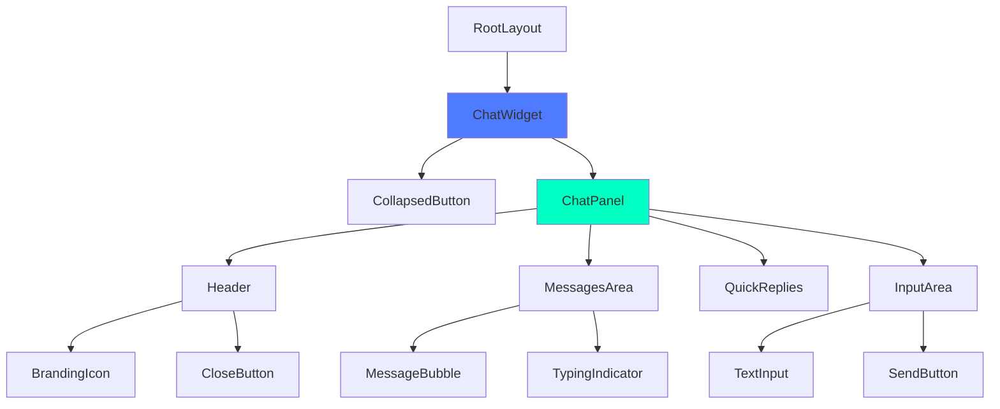
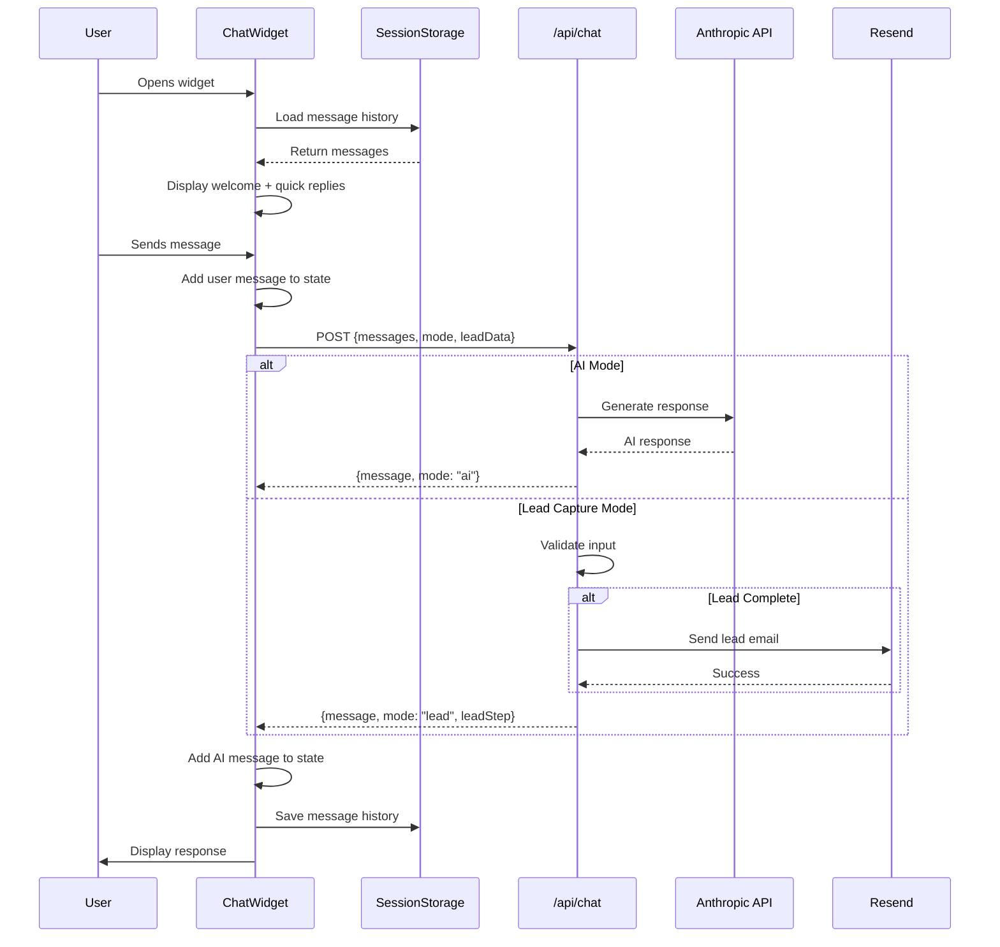

# Design Document: AI Chat Widget

## Overview

The AI Chat Widget is a persistent, intelligent chatbot component that provides 24/7 customer service and lead capture capabilities for TomNerb Digital Solutions. The widget operates in two distinct modes: **AI Customer Service Mode** (default) for answering questions about TomNerb's services using the Anthropic Claude API, and **Lead Capture Mode** for collecting contact information from potential clients via email using the Resend SDK.

The widget is implemented as a global React component rendered in the root layout, ensuring it persists across all pages. It features smooth animations powered by Framer Motion, session-based state persistence, and a mobile-responsive design that adapts to different viewport sizes.

### Key Design Goals

1. **Persistent Availability**: Widget accessible on every page without page refreshes
2. **Intelligent Interaction**: AI-powered responses using Claude Haiku 4.5 model
3. **Seamless Lead Capture**: Smooth transition from AI mode to lead collection
4. **Performance**: Lazy loading to avoid impacting initial page load
5. **Accessibility**: WCAG 2.1 Level AA compliance with keyboard and screen reader support
6. **Mobile-First**: Responsive design that works across all devices

## Architecture

### High-Level System Architecture

```mermaid
graph TB
    subgraph "Client Layer"
        A[ChatWidget Component]
        B[Session Storage]
        C[Framer Motion]
    end
    
    subgraph "API Layer"
        D[/api/chat Route Handler]
        E[/api/lead Route Handler]
    end
    
    subgraph "External Services"
        F[Anthropic Claude API]
        G[Resend Email Service]
    end
    
    subgraph "Configuration"
        H[Environment Variables]
        I[Site Data Config]
    end
    
    A -->|POST /api/chat| D
    A -->|POST /api/lead| E
    A <-->|Read/Write| B
    A -->|Animations| C
    D -->|AI Requests| F
    E -->|Send Email| G
    D -->|Read Config| H
    E -->|Read Config| H
    A -->|Read Config| I
    
    style A fill:#4F7CFF
    style D fill:#00FFC2
    style E fill:#00FFC2
    style F fill:#FF6B6B
    style G fill:#FF6B6B
```

### Component Hierarchy



### Data Flow



## Components and Interfaces

### 1. ChatWidget Component

**Location**: `app/components/layout/ChatWidget.tsx`

**Responsibility**: Main orchestrator component managing widget state, user interactions, and API communication.

**State Management**:
```typescript
interface ChatWidgetState {
  isOpen: boolean;                    // Widget expanded/collapsed
  messages: Message[];                // Conversation history
  inputValue: string;                 // Current input text
  isLoading: boolean;                 // API request in progress
  mode: "ai" | "lead";               // Current operation mode
  leadStep?: "name" | "email" | "message" | "complete";
  leadData: {
    name?: string;
    email?: string;
  };
  hasShownWelcome: boolean;          // Welcome message displayed flag
}
```

**Key Methods**:
- `handleSend()`: Sends user message to API
- `handleQuickReply(value: string)`: Handles quick reply chip clicks
- `formatTime(date: Date)`: Formats message timestamps

**Hooks Used**:
- `useState`: Local state management
- `useEffect`: Side effects (welcome message, auto-scroll, keyboard listeners, session persistence)
- `useRef`: DOM references (messages end, input field, panel)
- `useCallback`: Memoized send handler

### 2. CollapsedButton Sub-component

**Rendered When**: `isOpen === false`

**Features**:
- Circular button with sparkle icon (✦)
- Continuous pulse ring animation
- 56px × 56px touch target
- Hover scale effect (110%)
- Positioned bottom-right (24px from edges)

**Accessibility**:
- `aria-label="Open chat"`
- Keyboard focusable
- Enter/Space to activate

### 3. ChatPanel Sub-component

**Rendered When**: `isOpen === true`

**Dimensions**:
- Desktop: 350px × 500px
- Mobile (<768px): calc(100vw - 48px) × calc(100vh - 48px)

**Sub-sections**:

#### Header
- TomNerb branding with sparkle icon
- Widget title from config
- Close button (X icon)

#### Messages Area
- Scrollable container
- Message bubbles (user right-aligned, AI left-aligned)
- Avatar icons (User/Bot)
- Timestamps (grouped if within 1 minute)
- Typing indicator during loading
- Auto-scroll to latest message

#### Quick Replies
- Displayed after welcome message only
- Removed after first user interaction
- Styled as pill buttons with neon accent
- Configurable from `siteData.ts`

#### Input Area
- Text input field
- Send button (disabled when empty or loading)
- Enter key to send
- Loading spinner during API calls

### 4. Message Component

**Type Definition**:
```typescript
interface Message {
  id: string;                    // Unique identifier
  role: "user" | "assistant";    // Message sender
  content: string;               // Message text
  timestamp: Date;               // Creation time
}
```

**Styling**:
- User messages: Blue background (#4F7CFF), right-aligned
- AI messages: Gray background (border/50), left-aligned
- Rounded corners with tail effect
- Timestamp in small text below content

### 5. TypingIndicator Component

**Displayed When**: `isLoading === true`

**Animation**: Three dots bouncing with staggered delays (0ms, 150ms, 300ms)

**Styling**: Matches AI message bubble appearance

## Data Models

### TypeScript Interfaces

```typescript
// Message structure
interface Message {
  id: string;
  role: "user" | "assistant";
  content: string;
  timestamp: Date;
}

// Chat API Request
interface ChatRequest {
  messages: Array<{
    role: "user" | "assistant";
    content: string;
  }>;
  mode?: "ai" | "lead";
  leadStep?: "name" | "email" | "message" | "complete";
  leadData?: {
    name?: string;
    email?: string;
  };
}

// Chat API Response
interface ChatResponse {
  message: {
    role: "assistant";
    content: string;
  };
  mode: "ai" | "lead";
  leadStep?: "name" | "email" | "message" | "complete";
  leadData: {
    name?: string;
    email?: string;
  };
}

// Lead Submission Request
interface LeadSubmitRequest {
  name: string;
  email: string;
  message: string;
  timestamp: string;
}

// Session Storage Structure
interface SessionData {
  messages: Message[];
  mode: "ai" | "lead";
  leadData: {
    name?: string;
    email?: string;
  };
  lastUpdated: string;
}
```

### Environment Variables

```bash
# Anthropic API Configuration
ANTHROPIC_API_KEY=sk-ant-...           # Required
ANTHROPIC_MODEL=claude-haiku-4-5       # Optional, defaults to haiku

# Resend Email Configuration
RESEND_API_KEY=re_...                  # Required
RESEND_FROM_EMAIL=noreply@tomnerb.com  # Required
RESEND_TO_EMAIL=info@tomnerb.com       # Required

# Rate Limiting
MAX_AI_MESSAGES_PER_SESSION=20         # Optional, default 20
MAX_LEAD_SUBMISSIONS_PER_SESSION=3     # Optional, default 3
```

## API Endpoints

### POST /api/chat

**Purpose**: Handle AI responses and lead capture flow

**Request Body**:
```json
{
  "messages": [
    { "role": "user", "content": "What services do you offer?" }
  ],
  "mode": "ai",
  "leadStep": null,
  "leadData": {}
}
```

**Response**:
```json
{
  "message": {
    "role": "assistant",
    "content": "We offer custom software development..."
  },
  "mode": "ai",
  "leadStep": null,
  "leadData": {}
}
```

**Logic Flow**:
1. Extract last user message
2. Check if in lead capture mode
   - If yes: Process lead capture step
   - If no: Check for lead trigger words
3. If AI mode: Call Anthropic API with system prompt
4. Return response with updated mode/step

**Error Handling**:
- 400: Missing user message
- 500: API failure (returns friendly error message)
- Logs errors to console for debugging

### POST /api/lead

**Purpose**: Submit completed lead information via email

**Request Body**:
```json
{
  "name": "John Doe",
  "email": "john@example.com",
  "message": "I need help with automation",
  "timestamp": "2026-01-15T10:30:00Z"
}
```

**Response**:
```json
{
  "success": true,
  "message": "Lead submitted successfully"
}
```

**Logic Flow**:
1. Validate all required fields
2. Validate email format
3. Check rate limit (max 3 per session)
4. Send email via Resend SDK
5. Return success/error response

**Email Template**:
```
Subject: New Lead from Chat Widget

Name: {name}
Email: {email}
Timestamp: {timestamp}

Message:
{message}

---
Sent from TomNerb Chat Widget
```

## State Management

### Local Component State

The ChatWidget uses React's `useState` for all state management. No external state management library (Redux, Zustand) is needed due to the component's isolated nature.

**State Variables**:
- `isOpen`: Controls widget visibility
- `messages`: Array of conversation messages
- `inputValue`: Current text input value
- `isLoading`: API request status
- `mode`: Current operation mode ("ai" | "lead")
- `leadStep`: Current lead capture step
- `leadData`: Collected lead information
- `hasShownWelcome`: Prevents duplicate welcome messages

### Session Persistence

**Storage Key**: `tomnerb_chat_session`

**Stored Data**:
```json
{
  "messages": [...],
  "mode": "ai",
  "leadData": {},
  "lastUpdated": "2026-01-15T10:30:00Z"
}
```

**Persistence Strategy**:
- Save to `sessionStorage` after each message
- Load from `sessionStorage` on component mount
- Clear on browser/tab close (automatic)
- Expire after 30 minutes of inactivity

**Implementation**:
```typescript
// Save
useEffect(() => {
  if (messages.length > 0) {
    sessionStorage.setItem('tomnerb_chat_session', JSON.stringify({
      messages,
      mode,
      leadData,
      lastUpdated: new Date().toISOString()
    }));
  }
}, [messages, mode, leadData]);

// Load
useEffect(() => {
  const saved = sessionStorage.getItem('tomnerb_chat_session');
  if (saved) {
    const data = JSON.parse(saved);
    const lastUpdated = new Date(data.lastUpdated);
    const now = new Date();
    const diffMinutes = (now.getTime() - lastUpdated.getTime()) / 60000;
    
    if (diffMinutes < 30) {
      setMessages(data.messages);
      setMode(data.mode);
      setLeadData(data.leadData);
    }
  }
}, []);
```

## Animation System

### Framer Motion Configuration

**Library**: `framer-motion@^12.4.7`

**Animation Variants**:

```typescript
// Widget expand/collapse
const panelVariants = {
  hidden: {
    scale: 0,
    opacity: 0,
    originX: 1,
    originY: 1,
  },
  visible: {
    scale: 1,
    opacity: 1,
    transition: {
      type: "spring",
      stiffness: 300,
      damping: 30,
    },
  },
};

// Message entrance
const messageVariants = {
  hidden: { opacity: 0, y: 10 },
  visible: {
    opacity: 1,
    y: 0,
    transition: {
      duration: 0.3,
      ease: "easeOut",
    },
  },
};

// Button pulse (CSS)
@keyframes pulse-ring {
  0% {
    transform: scale(1);
    opacity: 0.3;
  }
  100% {
    transform: scale(1.5);
    opacity: 0;
  }
}
```

### Animation Performance

**GPU Acceleration**: All animations use `transform` and `opacity` properties only

**Frame Rate Target**: 60 FPS

**Animation Durations**:
- Widget expand/collapse: 300ms
- Message entrance: 300ms
- Hover effects: 200ms
- Pulse ring: 2000ms (continuous)
- Typing indicator: 1500ms (continuous)

### Accessibility Considerations

- `prefers-reduced-motion` media query support
- Disable animations for users who prefer reduced motion
- Maintain functionality without animations

```css
@media (prefers-reduced-motion: reduce) {
  * {
    animation-duration: 0.01ms !important;
    animation-iteration-count: 1 !important;
    transition-duration: 0.01ms !important;
  }
}
```

## Error Handling

### Client-Side Error Handling

**Network Errors**:
```typescript
try {
  const response = await fetch("/api/chat", {...});
  if (!response.ok) throw new Error("Failed to fetch response");
  // Process response
} catch (error) {
  console.error("Chat error:", error);
  setMessages(prev => [...prev, createMessage(
    "assistant",
    `Sorry, I'm having trouble connecting right now. Please try again or email us directly at ${company.email}`
  )]);
}
```

**Validation Errors**:
- Empty message: Disable send button
- Invalid email: Show inline error message
- Rate limit exceeded: Display friendly message with wait time

**User-Friendly Messages**:
- "Sorry, I'm having trouble connecting right now. Please try again or email us directly at info@tomnerb.com"
- "That doesn't look like a valid email address. Could you please double-check it?"
- "You've reached the message limit for this session. Please email us directly at info@tomnerb.com"

### Server-Side Error Handling

**API Route Error Handling**:
```typescript
export async function POST(request: NextRequest) {
  try {
    // Process request
  } catch (error) {
    console.error("Chat API error:", error);
    return NextResponse.json({
      message: {
        role: "assistant",
        content: "I apologize, but I'm having trouble connecting right now. Please try again in a moment, or email us directly at info@tomnerb.com.",
      },
      mode: "ai",
      leadStep: undefined,
      leadData: {},
    });
  }
}
```

**Anthropic API Errors**:
- Rate limit: Return friendly message with retry suggestion
- Invalid API key: Log error, return generic error message
- Timeout: Return timeout message with alternative contact method

**Resend API Errors**:
- Invalid email: Return validation error
- Send failure: Log error, suggest direct email contact
- Rate limit: Return friendly message

### Error Logging

**Console Logging**:
```typescript
console.error("Context:", {
  error: error.message,
  stack: error.stack,
  timestamp: new Date().toISOString(),
  mode,
  leadStep,
});
```

**Production Considerations**:
- Integrate with error tracking service (Sentry, LogRocket)
- Log to server-side logging service
- Track error rates and patterns
- Alert on critical errors

## Testing Strategy

### Property-Based Testing Applicability

**Assessment**: Property-based testing is **NOT the primary testing approach** for this feature.

**Reasoning**:
- The AI Chat Widget is primarily a **UI component** with rendering, animations, and user interactions
- Core functionality involves **external API integrations** (Anthropic, Resend) which are not pure functions
- Most behavior involves **side effects** (DOM manipulation, session storage, network requests)
- Testing focuses on **specific user scenarios** rather than universal properties across infinite inputs

**Limited PBT Applicability**:
Only 2 utility functions are suitable for property-based testing:
1. **Email validation** (`validateEmail()`) - Pure function with universal properties
2. **Message serialization** (Requirement 25.5) - Round-trip property

For these specific functions, property-based tests will be written. However, the bulk of testing will use **example-based unit tests**, **integration tests**, and **end-to-end tests**.

### Unit Testing

**Test Framework**: Vitest (to be installed)

**Component Tests** (Example-Based):
- ChatWidget state management
  - Initial state is correct
  - Opening widget shows welcome message
  - Closing widget clears input
  - Mode switching updates UI correctly
- Message rendering
  - User messages align right with blue background
  - AI messages align left with gray background
  - Timestamps display correctly
- Input validation
  - Send button disabled when input empty
  - Send button enabled when input has text
  - Enter key sends message
- Quick reply functionality
  - Quick replies shown after welcome message
  - Clicking quick reply sends message
  - Quick replies hidden after first interaction
- Mode switching logic
  - Lead trigger words switch to lead mode
  - Lead capture collects name, email, message in sequence
  - Completion returns to AI mode

**Utility Function Tests**:

**Example-Based Tests**:
- `createMessage()`: Message object creation with correct structure
- `formatTime()`: Timestamp formatting for different times
- `generateId()`: Unique ID generation (collision testing)

**Property-Based Tests** (using fast-check):
```typescript
import fc from "fast-check";

describe("validateEmail - Property Tests", () => {
  it("should accept all valid email formats", () => {
    fc.assert(
      fc.property(
        fc.emailAddress(),
        (email) => {
          expect(validateEmail(email)).toBe(true);
        }
      ),
      { numRuns: 100 }
    );
  });

  it("should reject strings without @ symbol", () => {
    fc.assert(
      fc.property(
        fc.string().filter(s => !s.includes("@")),
        (invalidEmail) => {
          expect(validateEmail(invalidEmail)).toBe(false);
        }
      ),
      { numRuns: 100 }
    );
  });
});

describe("Message Serialization - Property Tests", () => {
  it("should preserve message structure through JSON round-trip", () => {
    fc.assert(
      fc.property(
        fc.record({
          id: fc.string(),
          role: fc.constantFrom("user", "assistant"),
          content: fc.string(),
          timestamp: fc.date(),
        }),
        (message) => {
          const serialized = JSON.stringify(message);
          const deserialized = JSON.parse(serialized);
          expect(deserialized).toEqual({
            ...message,
            timestamp: message.timestamp.toISOString(),
          });
        }
      ),
      { numRuns: 100 }
    );
  });
});
```

**Example-Based Tests**:
```typescript
describe("validateEmail - Example Tests", () => {
  it("should accept valid email addresses", () => {
    expect(validateEmail("test@example.com")).toBe(true);
    expect(validateEmail("user+tag@domain.co.uk")).toBe(true);
    expect(validateEmail("name.surname@company.com")).toBe(true);
  });

  it("should reject invalid email addresses", () => {
    expect(validateEmail("invalid")).toBe(false);
    expect(validateEmail("@example.com")).toBe(false);
    expect(validateEmail("test@")).toBe(false);
    expect(validateEmail("test @example.com")).toBe(false);
  });
});
```

### Integration Testing

**Test Framework**: Vitest with MSW (Mock Service Worker)

**API Route Tests**:
- POST /api/chat with AI mode
  - Returns AI response for valid input
  - Handles empty message array
  - Switches to lead mode on trigger words
- POST /api/chat with lead capture mode
  - Validates name (min 2 characters)
  - Validates email format
  - Collects message and completes flow
- POST /api/lead with valid data
  - Sends email via Resend
  - Returns success response
- Error handling for invalid requests
  - Returns 400 for missing data
  - Returns 500 for API failures
  - Returns friendly error messages

**Mock External Services**:
```typescript
import { setupServer } from "msw/node";
import { http, HttpResponse } from "msw";

const server = setupServer(
  // Mock Anthropic API
  http.post("https://api.anthropic.com/v1/messages", () => {
    return HttpResponse.json({
      content: [{ text: "Mocked AI response" }],
    });
  }),
  
  // Mock Resend API
  http.post("https://api.resend.com/emails", () => {
    return HttpResponse.json({ id: "mock-email-id" });
  })
);
```

**Rate Limiting Tests**:
- Verify 20 message limit per session
- Verify 3 lead submission limit per session
- Verify friendly error messages when limits exceeded

### End-to-End Testing

**Test Framework**: Playwright (to be installed)

**Test Scenarios**:
1. **Happy Path - AI Interaction**
   - Open widget → See welcome message → Click quick reply → Receive AI response
   - Verify message appears in chat
   - Verify typing indicator shows during loading
   - Verify auto-scroll to latest message

2. **Happy Path - Custom Message**
   - Send custom message → Receive AI response → Verify message history
   - Verify input clears after send
   - Verify send button disabled during loading

3. **Happy Path - Lead Capture**
   - Trigger lead capture → Complete form → Verify success message
   - Enter name → Verify prompt for email
   - Enter email → Verify prompt for message
   - Enter message → Verify success confirmation

4. **Session Persistence**
   - Navigate between pages → Verify message history persists
   - Send message on page 1 → Navigate to page 2 → Verify message still visible
   - Close widget → Navigate → Reopen → Verify messages restored

5. **State Restoration**
   - Close and reopen widget → Verify state restoration
   - Verify messages persist
   - Verify mode persists (if in lead capture)

6. **Mobile Responsive**
   - Test on mobile viewport (375px width)
   - Verify widget adapts dimensions
   - Verify touch targets are 56px minimum
   - Verify mobile keyboard doesn't obscure input

7. **Keyboard Navigation**
   - Tab to collapsed button → Press Enter → Verify opens
   - Tab to input → Type message → Press Enter → Verify sends
   - Press Escape → Verify closes

8. **Screen Reader**
   - Verify ARIA labels announced
   - Verify new messages announced via aria-live
   - Verify focus management correct

### Accessibility Testing

**Manual Testing**:
- Keyboard navigation (Tab, Enter, Escape)
- Screen reader testing (NVDA, JAWS, VoiceOver)
- Color contrast verification (4.5:1 minimum)
- Focus indicator visibility
- Touch target sizes (56px minimum)

**Automated Testing**:
- axe-core integration in Playwright tests
- WAVE browser extension manual checks
- Lighthouse accessibility audit (score > 95)

**WCAG 2.1 Level AA Compliance Checklist**:
- [x] All interactive elements keyboard accessible
- [x] Sufficient color contrast (4.5:1 for text)
- [x] ARIA labels and roles present
- [x] Focus management correct
- [x] Screen reader announcements for dynamic content
- [x] Touch targets minimum 56px
- [x] No keyboard traps
- [x] Skip links where appropriate

### Visual Regression Testing

**Tool**: Percy or Chromatic

**Snapshots**:
- Collapsed button state
- Expanded widget with welcome message
- Widget with conversation history
- Widget with quick replies
- Widget in lead capture mode
- Mobile responsive views
- Dark theme variations
- Loading states
- Error states

## Security Considerations

### API Key Protection

**Environment Variables**:
- Never commit `.env` files to version control
- Use `.env.local` for local development
- Use platform environment variables for production (Vercel, Netlify)

**Server-Side Only**:
- All API keys accessed only in API routes (server-side)
- Never expose keys to client-side code
- Validate environment variables on server startup

### Input Validation

**Client-Side**:
- Email format validation
- Message length limits (max 1000 characters)
- Sanitize HTML special characters

**Server-Side**:
- Validate all inputs before processing
- Escape user content before sending to AI
- Validate email format before sending

**XSS Prevention**:
```typescript
function sanitizeInput(input: string): string {
  return input
    .replace(/</g, "&lt;")
    .replace(/>/g, "&gt;")
    .replace(/"/g, "&quot;")
    .replace(/'/g, "&#x27;")
    .replace(/\//g, "&#x2F;");
}
```

### Rate Limiting

**Session-Based Limits**:
- Max 20 AI messages per session
- Max 3 lead submissions per session
- Tracked in session storage

**Implementation**:
```typescript
const AI_MESSAGE_LIMIT = 20;
const LEAD_SUBMISSION_LIMIT = 3;

// Check limit
const messageCount = messages.filter(m => m.role === "user").length;
if (messageCount >= AI_MESSAGE_LIMIT) {
  return {
    message: "You've reached the message limit for this session. Please email us directly at info@tomnerb.com",
    mode: "ai",
  };
}
```

**Future Enhancements**:
- IP-based rate limiting
- Redis-based distributed rate limiting
- Exponential backoff for repeated requests

### Content Security Policy

**CSP Headers**:
```
Content-Security-Policy:
  default-src 'self';
  script-src 'self' 'unsafe-inline' 'unsafe-eval';
  style-src 'self' 'unsafe-inline';
  connect-src 'self' https://api.anthropic.com https://api.resend.com;
  img-src 'self' data: https:;
  font-src 'self' data:;
```

**Considerations**:
- Allow connections to Anthropic and Resend APIs
- Minimize use of `unsafe-inline` and `unsafe-eval`
- Use nonces for inline scripts if possible

### Data Privacy

**User Data Handling**:
- No persistent storage of chat messages on server
- Session storage cleared on browser close
- Lead data sent via email only (not stored in database)

**GDPR Compliance**:
- Clear privacy policy link
- User consent for data collection
- Right to data deletion (email-based request)

**Future Considerations**:
- Add cookie consent banner
- Implement data retention policy
- Add privacy policy acceptance checkbox

## File Structure

```
app/
├── components/
│   └── layout/
│       └── ChatWidget.tsx              # Main widget component
├── api/
│   ├── chat/
│   │   └── route.ts                    # Chat API endpoint
│   └── lead/
│       └── route.ts                    # Lead submission endpoint
├── lib/
│   ├── chat.ts                         # Chat utilities
│   └── animations.ts                   # Animation variants
├── data/
│   └── siteData.ts                     # Configuration
└── layout.tsx                          # Root layout (renders ChatWidget)

.env.local                              # Environment variables (not committed)
```

### Component File Organization

**ChatWidget.tsx Structure**:
```typescript
"use client";

// 1. Imports
import { useState, useRef, useEffect, useCallback } from "react";
import { X, Send, Sparkles, Loader2, Bot, User } from "lucide-react";
import { Message, createMessage } from "@/app/lib/chat";
import { siteConfig } from "@/app/data/siteData";

// 2. Constants
const { chat, company } = siteConfig;
const AI_MESSAGE_LIMIT = 20;
const LEAD_SUBMISSION_LIMIT = 3;

// 3. Component
export default function ChatWidget() {
  // State declarations
  // Refs
  // Effects
  // Handlers
  // Render
}
```

## Deployment Considerations

### Environment Setup

**Vercel Deployment**:
1. Add environment variables in Vercel dashboard
2. Configure build settings (Next.js 16)
3. Enable Edge Functions for API routes (optional)

**Environment Variables Checklist**:
- [ ] ANTHROPIC_API_KEY
- [ ] ANTHROPIC_MODEL (optional)
- [ ] RESEND_API_KEY
- [ ] RESEND_FROM_EMAIL
- [ ] RESEND_TO_EMAIL

### Performance Optimization

**Lazy Loading**:
```typescript
// In layout.tsx
const ChatWidget = dynamic(() => import("@/app/components/layout/ChatWidget"), {
  ssr: false,
  loading: () => null,
});
```

**Code Splitting**:
- Widget code loaded separately from main bundle
- Framer Motion tree-shaken to include only used features
- Lucide icons imported individually

**Bundle Size Targets**:
- ChatWidget component: < 50KB gzipped
- Total widget bundle (with dependencies): < 150KB gzipped

### Monitoring

**Metrics to Track**:
- Widget open rate
- Message send rate
- Lead conversion rate
- API error rate
- Average response time
- Session duration

**Analytics Events**:
```typescript
// Widget opened
analytics.track("chat_widget_opened", {
  timestamp: new Date().toISOString(),
  page: window.location.pathname,
});

// Message sent
analytics.track("chat_message_sent", {
  mode: "ai",
  messageCount: messages.length,
});

// Lead captured
analytics.track("lead_captured", {
  source: "chat_widget",
  timestamp: new Date().toISOString(),
});
```

### Rollback Strategy

**Feature Flags**:
```typescript
// In siteData.ts
export const features = {
  chatWidget: {
    enabled: true,
    aiMode: true,
    leadCapture: true,
  },
};

// In layout.tsx
{features.chatWidget.enabled && <ChatWidget />}
```

**Gradual Rollout**:
1. Deploy with feature flag disabled
2. Enable for internal testing
3. Enable for 10% of users
4. Monitor metrics and errors
5. Gradually increase to 100%

## Future Enhancements

### Phase 2 Features

1. **Message History Export**
   - Download conversation as PDF
   - Email transcript to user

2. **Rich Media Support**
   - Image attachments
   - File uploads
   - Link previews

3. **Multi-Language Support**
   - Detect user language
   - Translate AI responses
   - Localized UI

4. **Advanced Analytics**
   - Conversation sentiment analysis
   - Topic clustering
   - User journey tracking

5. **Proactive Engagement**
   - Trigger widget based on user behavior
   - Exit intent detection
   - Time-based prompts

### Phase 3 Features

1. **Voice Input**
   - Speech-to-text
   - Voice responses

2. **Video Chat Integration**
   - Escalate to live video call
   - Screen sharing

3. **CRM Integration**
   - Sync leads to HubSpot/Salesforce
   - Track conversation history

4. **AI Training**
   - Fine-tune model on company data
   - Custom knowledge base

5. **A/B Testing**
   - Test different welcome messages
   - Optimize quick replies
   - Measure conversion rates

---

## Appendix

### Design Decisions

**Why Anthropic Claude over OpenAI GPT?**
- Better instruction following
- More natural conversational tone
- Competitive pricing
- Strong safety features

**Why Session Storage over Local Storage?**
- Automatic cleanup on browser close
- Privacy-friendly (no persistent tracking)
- Simpler implementation

**Why No External State Management?**
- Component is isolated
- No shared state with other components
- React's built-in state sufficient

**Why Framer Motion over CSS Animations?**
- Better React integration
- More control over animation lifecycle
- Spring physics for natural feel
- Easier to maintain

### References

- [Anthropic Claude API Documentation](https://docs.anthropic.com/)
- [Resend API Documentation](https://resend.com/docs)
- [Framer Motion Documentation](https://www.framer.com/motion/)
- [Next.js 16 API Routes](https://nextjs.org/docs)
- [WCAG 2.1 Guidelines](https://www.w3.org/WAI/WCAG21/quickref/)
- [React Hooks Documentation](https://react.dev/reference/react)

### Glossary

- **Widget**: The AI Chat Widget component
- **Chat Panel**: The expanded chat interface
- **Collapsed Button**: The circular button shown when minimized
- **AI Service**: The Anthropic Claude API integration
- **Lead Capture System**: The email-based lead collection subsystem
- **Session**: A single browser session from page load to close
- **Quick Reply Chip**: A clickable button suggesting common questions
- **Typing Indicator**: Visual feedback showing the AI is processing
- **System Prompt**: The instruction set defining the AI's behavior

---

**Document Version**: 1.0  
**Last Updated**: 2026-01-15  
**Author**: TomNerb Development Team  
**Status**: Ready for Implementation
