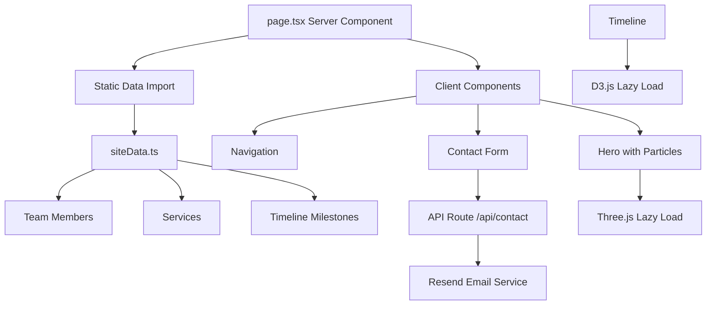

# Design Document: TomNerb Digital Solutions Portfolio Homepage

## Overview

The TomNerb Digital Solutions Portfolio Homepage is a high-performance, single-page React application built with Next.js 16, React 19, TypeScript, Tailwind CSS v4, and Framer Motion. The design emphasizes **fluid animations, micro-interactions, and visual polish** to create an immersive, premium experience that showcases the company's technical capabilities.

### Design Philosophy

The design draws inspiration from industry leaders (D3.js, Vercel, Linear.app) while maintaining a unique identity through:

- **Animation-First Approach**: Every interaction is choreographed with precise timing and easing
- **Dark Theme Elegance**: Deep backgrounds (#060810) with electric blue (#4F7CFF) and teal neon (#00FFC2) accents
- **Performance as a Feature**: Sub-1.8s LCP, 60 FPS animations, Lighthouse 95+ scores
- **Progressive Enhancement**: Core content accessible, animations enhance the experience
- **Accessibility by Default**: WCAG AA compliance, keyboard navigation, screen reader support

### Key Technical Decisions

1. **Next.js 16 App Router**: Server components for static content, client components for interactivity
2. **Framer Motion**: Primary animation library for React-based animations with spring physics
3. **Three.js**: WebGL particle system for hero background (lazy-loaded, performance-optimized)
4. **D3.js**: Timeline visualization with custom animations (lazy-loaded)
5. **Tailwind CSS v4**: Utility-first styling with custom animation utilities
6. **TypeScript Strict Mode**: Full type safety across components and APIs


## Architecture

### Component Hierarchy

```
app/
├── page.tsx (Server Component - Main Layout)
│   ├── Navigation (Client - Sticky header with blur)
│   ├── Hero (Client - Three.js particles + typewriter)
│   ├── About (Client - Cambodia map animation)
│   ├── VisionMissionGoal (Client - Interactive cards)
│   ├── Timeline (Client - D3.js visualization)
│   ├── Services (Client - Magic hover grid)
│   ├── Team (Client - Animated profiles)
│   └── Contact (Client - Form with validation)
├── CustomCursor (Client - Desktop only)
├── ScrollProgress (Client - Progress indicator)
└── BackToTop (Client - Floating action button)
```

### Data Flow Architecture



### Animation Architecture

**Three-Tier Animation System:**

1. **CSS Animations** (Lowest overhead)
   - Simple fades, slides, glows
   - Defined in `globals.css`
   - GPU-accelerated transforms

2. **Framer Motion** (Primary animation engine)
   - Scroll-triggered reveals
   - Interactive hover states
   - Orchestrated sequences
   - Spring physics for natural motion

3. **Canvas-Based** (Heavy effects)
   - Three.js particle system (Hero)
   - D3.js timeline visualization
   - Lazy-loaded, performance-monitored

### Performance Architecture

**Code Splitting Strategy:**

```typescript
// Heavy libraries loaded on-demand
const ParticleCanvas = dynamic(() => import('@/app/components/ui/ParticleCanvas'), {
  ssr: false,
  loading: () => <ParticleCanvasSkeleton />
});

const Timeline = dynamic(() => import('@/app/sections/Timeline'), {
  ssr: false,
  loading: () => <TimelineSkeleton />
});
```

**Asset Loading Strategy:**

- **Critical Path**: Navigation, Hero text, above-fold content
- **Deferred**: Three.js, D3.js, below-fold images
- **Lazy**: Images with Next.js Image component (automatic optimization)
- **Preload**: Critical fonts (Geist Sans, Geist Mono)


## Components and Interfaces

### Core Component Specifications

#### 1. Navigation Component

**Purpose**: Sticky navigation with blur effect and smooth anchor scrolling

**Props Interface:**
```typescript
interface NavigationProps {
  sections: Array<{
    id: string;
    label: string;
  }>;
}
```

**Animation Specifications:**

- **Scroll Threshold**: 50px
- **Blur Transition**: 
  - Duration: 300ms
  - Easing: `cubic-bezier(0.4, 0, 0.2, 1)`
  - Backdrop blur: 0 → 12px
  - Background opacity: 0 → 0.7
- **Link Hover**:
  - Color transition: 300ms ease
  - Underline slide-in: 200ms `cubic-bezier(0.4, 0, 1, 1)`
  - Scale: 1 → 1.02 (subtle)
- **Active Section Indicator**:
  - Animated dot or underline
  - Transition: 400ms spring (stiffness: 300, damping: 30)

**Behavior:**
- Intersection Observer tracks active section
- Smooth scroll with offset for fixed header (80px)
- Mobile: Hamburger menu with slide-in drawer (300ms ease-out)

---

#### 2. Hero Section with Particle Canvas

**Purpose**: Immersive first impression with animated particles and typewriter effect

**Props Interface:**
```typescript
interface HeroProps {
  tagline: string;
  stats: Array<{
    label: string;
    value: number;
    suffix?: string;
  }>;
}

interface ParticleCanvasProps {
  particleCount?: number; // Default: 100 (desktop), 50 (mobile)
  mouseInfluence?: number; // Default: 0.3
  colorPrimary?: string;   // Default: #4F7CFF
  colorSecondary?: string; // Default: #00FFC2
}
```

**Animation Specifications:**

**Typewriter Effect:**
- Character delay: 50ms
- Cursor blink: 530ms interval
- Cursor fade-out: 500ms after completion
- Total duration: ~3s for 60-character tagline
- Easing: Linear for typing, ease-out for cursor fade

**Stat Counters:**
- Start: 0
- End: Target value
- Duration: 2000ms
- Easing: `cubic-bezier(0.33, 1, 0.68, 1)` (ease-out-cubic)
- Stagger: 100ms between counters
- Number formatting: Locale-aware (e.g., 1,000)

**Particle System:**
- Particle movement: Perlin noise-based flow field
- Mouse interaction radius: 150px
- Attraction/repulsion strength: 0.3
- Particle speed: 0.5-1.5 units/frame
- Connection lines: Draw when distance < 120px
- Line opacity: Inverse distance (closer = more opaque)
- FPS target: 60 (throttle to 30 on low-end devices)

**Performance Optimizations:**
- Reduce particle count on mobile (50 vs 100)
- Disable mouse interaction on touch devices
- Use `requestAnimationFrame` for smooth rendering
- Pause animation when tab is inactive

---

#### 3. About Section with Cambodia Map

**Purpose**: Company story with animated geographic visualization

**Props Interface:**
```typescript
interface AboutProps {
  story: string;
  mapData: {
    svgPath: string;
    markerPosition: { x: number; y: number };
    markerLabel: string;
  };
}
```

**Animation Specifications:**

**Map Draw-In Effect:**
- SVG path animation using `stroke-dasharray` and `stroke-dashoffset`
- Duration: 1500ms
- Easing: `cubic-bezier(0.65, 0, 0.35, 1)` (ease-in-out-cubic)
- Sequence:
  1. Border draws in (0-1000ms)
  2. Marker fades in (1000-1500ms)
  3. Marker pulse starts (1500ms+)

**Marker Pulse:**
- Scale: 1 → 1.2 → 1
- Duration: 2000ms
- Easing: ease-in-out
- Infinite loop
- Glow effect: `box-shadow` from 0 0 10px to 0 0 30px

**Text Reveal:**
- Fade in + slide up
- Duration: 600ms
- Stagger: 100ms per paragraph
- Trigger: When section enters viewport (threshold: 0.2)

**Layout:**
- Desktop (≥1024px): Two columns (60/40 split)
- Mobile (<1024px): Stack vertically, map below text

---

#### 4. Vision/Mission/Goal Cards

**Purpose**: Interactive cards showcasing company values

**Props Interface:**
```typescript
interface VisionCardProps {
  title: string;
  content: string;
  icon: React.ReactNode;
  accentColor: 'blue' | 'teal' | 'purple';
}
```

**Animation Specifications:**

**Hover Effect:**
- Scale: 1 → 1.05
- Duration: 300ms
- Easing: `cubic-bezier(0.34, 1.56, 0.64, 1)` (back-out)
- Border glow: Fade in 200ms
- Shadow: `0 10px 40px rgba(79, 124, 255, 0.3)`
- Z-index: Elevate to prevent overlap

**Border Gradient Animation:**
- Gradient position: 0% → 100% → 0%
- Duration: 3000ms
- Easing: Linear
- Infinite loop
- Colors: Accent → Neon → Accent

**Entrance Animation:**
- Fade in + scale from 0.9
- Duration: 500ms
- Stagger: 150ms per card
- Trigger: Intersection Observer (threshold: 0.3)

**Micro-Interactions:**
- Icon rotation on hover: 0deg → 5deg
- Duration: 200ms
- Spring physics: stiffness 400, damping 20

---

#### 5. Timeline Visualization (D3.js)

**Purpose**: Interactive roadmap from 2026-2030

**Props Interface:**
```typescript
interface TimelineProps {
  milestones: Array<{
    year: number;
    quarter: 'Q1' | 'Q2' | 'Q3' | 'Q4';
    title: string;
    description: string;
    status: 'completed' | 'in-progress' | 'planned';
  }>;
}
```

**Animation Specifications:**

**Initial Render:**
- Milestones fade in sequentially
- Duration: 400ms per milestone
- Stagger: 100ms
- Easing: ease-out
- Connection lines draw after milestones appear

**Hover Interaction:**
- Milestone scale: 1 → 1.15
- Duration: 200ms
- Easing: `cubic-bezier(0.34, 1.56, 0.64, 1)`
- Tooltip fade in: 150ms
- Tooltip position: Above milestone with 10px offset

**Scroll Behavior:**
- Horizontal scroll on mobile
- Snap to milestones (CSS scroll-snap)
- Scroll indicator fades out after 3s

**Visual Design:**
- Timeline axis: 2px solid line with gradient
- Milestones: Circles (completed: filled, planned: outlined)
- Active milestone: Pulsing glow effect
- Connection lines: Dashed for future milestones

---

#### 6. Services Grid with Magic Hover

**Purpose**: Showcase four service offerings with advanced hover effects

**Props Interface:**
```typescript
interface ServiceCardProps {
  title: string;
  description: string;
  icon: React.ReactNode;
  features: string[];
  link?: string;
}
```

**Animation Specifications:**

**Magic Hover Effect:**
- Gradient spotlight follows cursor position
- Calculation: `radial-gradient(circle at ${x}px ${y}px, ...)`
- Update frequency: 60fps (requestAnimationFrame)
- Gradient: 
  - Center: `rgba(79, 124, 255, 0.15)`
  - Edge: `rgba(79, 124, 255, 0)`
  - Radius: 200px
- Border glow intensity: Based on cursor proximity
- Transition: All 0ms (instant tracking)

**Card Entrance:**
- Fade in + slide up (20px)
- Duration: 600ms
- Stagger: 100ms (diagonal pattern: top-left → bottom-right)
- Easing: `cubic-bezier(0.25, 0.1, 0.25, 1)`

**Hover State:**
- Background: Lighten by 5%
- Border: Accent color with 1px width
- Shadow: `0 20px 60px rgba(79, 124, 255, 0.2)`
- Icon: Rotate 360deg over 600ms
- Duration: 300ms
- Easing: ease-out

**Feature List Animation:**
- Stagger reveal on hover
- Each item: Fade in + slide right (10px)
- Duration: 200ms per item
- Stagger: 50ms

---

#### 7. Team Grid

**Purpose**: Display six team member profiles with hover effects

**Props Interface:**
```typescript
interface TeamMemberProps {
  name: string;
  role: string;
  avatar: string;
  bio: string;
  social?: {
    linkedin?: string;
    github?: string;
    twitter?: string;
  };
}
```

**Animation Specifications:**

**Avatar Hover:**
- Scale: 1 → 1.1
- Duration: 300ms
- Easing: `cubic-bezier(0.34, 1.56, 0.64, 1)` (back-out)
- Border glow: Fade in accent color
- Grayscale: 100% → 0% (colorize on hover)

**Card Entrance:**
- Fade in + slide up (30px)
- Duration: 600ms
- Stagger: 80ms (row by row)
- Easing: ease-out

**Bio Reveal:**
- Height: 0 → auto
- Opacity: 0 → 1
- Duration: 300ms
- Easing: ease-in-out
- Trigger: Hover or focus

**Social Icons:**
- Hover: Scale 1.2, color shift to accent
- Duration: 200ms
- Easing: ease-out

**Responsive Grid:**
- Desktop (≥1024px): 3 columns
- Tablet (768-1023px): 2 columns
- Mobile (<768px): 1 column
- Gap: 24px (desktop), 16px (mobile)

---

#### 8. Contact Form

**Purpose**: User inquiry submission with real-time validation

**Props Interface:**
```typescript
interface ContactFormProps {
  onSubmit: (data: ContactFormData) => Promise<void>;
}

interface ContactFormData {
  name: string;
  email: string;
  subject: string;
  message: string;
}

interface FormFieldProps {
  label: string;
  name: string;
  type: 'text' | 'email' | 'textarea';
  required?: boolean;
  error?: string;
  value: string;
  onChange: (value: string) => void;
  onBlur: () => void;
}
```

**Animation Specifications:**

**Field Focus:**
- Label: Translate up and scale down
- Duration: 200ms
- Easing: ease-out
- Border color: Muted → Accent
- Glow: Fade in `0 0 0 3px rgba(79, 124, 255, 0.1)`

**Validation Feedback:**
- Error shake: Translate X: 0 → -10px → 10px → 0
- Duration: 400ms
- Easing: ease-in-out
- Error message: Fade in + slide down (5px)
- Duration: 200ms

**Success State:**
- Checkmark icon: Scale 0 → 1.2 → 1
- Duration: 400ms
- Easing: `cubic-bezier(0.68, -0.55, 0.265, 1.55)` (back)
- Border: Green glow
- Duration: 200ms

**Submit Button:**
- Loading state: Spinner rotation (360deg, 1s, linear, infinite)
- Disabled state: Opacity 0.5, cursor not-allowed
- Success state: Background color shift (300ms)
- Hover: Scale 1.02, shadow increase

**Form Entrance:**
- Fade in + slide up (40px)
- Duration: 600ms
- Easing: ease-out
- Trigger: Intersection Observer

---

#### 9. Custom Cursor (Desktop Only)

**Purpose**: Enhanced cursor for premium feel

**Props Interface:**
```typescript
interface CustomCursorProps {
  enabled?: boolean; // Default: true on desktop
}
```

**Animation Specifications:**

**Cursor Movement:**
- Follow mouse with 100ms delay (smooth easing)
- Easing: `cubic-bezier(0.25, 0.1, 0.25, 1)`
- Update: requestAnimationFrame (60fps)

**Hover States:**
- Default: 20px circle, accent color, 0.5 opacity
- Link hover: Scale to 40px, opacity 0.3
- Button hover: Scale to 50px, accent glow
- Text hover: Scale to 10px, full opacity

**Transitions:**
- Scale: 200ms ease-out
- Opacity: 150ms ease-in-out
- Color: 200ms ease

**Blend Mode:**
- `mix-blend-mode: difference` for contrast on any background

---

#### 10. Scroll Progress Indicator

**Purpose**: Visual feedback for scroll position

**Props Interface:**
```typescript
interface ScrollProgressProps {
  color?: string; // Default: accent color
  height?: number; // Default: 3px
}
```

**Animation Specifications:**

**Progress Bar:**
- Width: 0% → 100% based on scroll position
- Transition: None (instant update for responsiveness)
- Position: Fixed top
- Z-index: 9999

**Glow Effect:**
- Box shadow: `0 0 10px currentColor`
- Opacity: 0.6

**Fade In/Out:**
- Fade in: After 100px scroll
- Fade out: When at top
- Duration: 200ms
- Easing: ease-in-out


## Data Models

### Site Data Structure

**File**: `app/data/siteData.ts`

```typescript
export interface SiteData {
  company: CompanyInfo;
  hero: HeroData;
  about: AboutData;
  vision: VisionData;
  timeline: TimelineData;
  services: ServiceData[];
  team: TeamMember[];
  contact: ContactInfo;
}

interface CompanyInfo {
  name: string;
  tagline: string;
  description: string;
  founded: number;
  location: string;
}

interface HeroData {
  tagline: string;
  stats: Array<{
    label: string;
    value: number;
    suffix?: string;
    prefix?: string;
  }>;
}

interface AboutData {
  story: string;
  paragraphs: string[];
  map: {
    svgPath: string;
    markerPosition: { x: number; y: number };
    markerLabel: string;
  };
}

interface VisionData {
  vision: {
    title: string;
    content: string;
    icon: string;
  };
  mission: {
    title: string;
    content: string;
    icon: string;
  };
  goal: {
    title: string;
    content: string;
    icon: string;
  };
}

interface TimelineData {
  milestones: Array<{
    id: string;
    year: number;
    quarter: 'Q1' | 'Q2' | 'Q3' | 'Q4';
    title: string;
    description: string;
    status: 'completed' | 'in-progress' | 'planned';
  }>;
}

interface ServiceData {
  id: string;
  title: string;
  description: string;
  icon: string;
  features: string[];
  link?: string;
}

interface TeamMember {
  id: string;
  name: string;
  role: string;
  avatar: string;
  bio: string;
  social?: {
    linkedin?: string;
    github?: string;
    twitter?: string;
  };
}

interface ContactInfo {
  email: string;
  phone?: string;
  address?: string;
}
```

### API Request/Response Models

**Contact Form API** (`/api/contact/route.ts`)

```typescript
// Request
interface ContactRequest {
  name: string;
  email: string;
  subject: string;
  message: string;
}

// Response
interface ContactResponse {
  success: boolean;
  message: string;
  error?: string;
}

// Validation Schema
const contactSchema = {
  name: {
    required: true,
    minLength: 2,
    maxLength: 100,
  },
  email: {
    required: true,
    pattern: /^[^\s@]+@[^\s@]+\.[^\s@]+$/,
  },
  subject: {
    required: true,
    minLength: 5,
    maxLength: 200,
  },
  message: {
    required: true,
    minLength: 10,
    maxLength: 2000,
  },
};
```

### Animation Configuration Models

**File**: `app/lib/animations.ts`

```typescript
import { Variants, Transition } from 'framer-motion';

// Easing curves
export const easings = {
  easeOutCubic: [0.33, 1, 0.68, 1],
  easeInOutCubic: [0.65, 0, 0.35, 1],
  easeOutBack: [0.34, 1.56, 0.64, 1],
  easeInOutBack: [0.68, -0.55, 0.265, 1.55],
  smooth: [0.25, 0.1, 0.25, 1],
} as const;

// Duration presets (ms)
export const durations = {
  fast: 200,
  normal: 300,
  slow: 600,
  verySlow: 1000,
} as const;

// Spring configurations
export const springs = {
  gentle: { stiffness: 300, damping: 30 },
  bouncy: { stiffness: 400, damping: 20 },
  stiff: { stiffness: 500, damping: 40 },
} as const;

// Stagger configurations
export const staggers = {
  fast: { staggerChildren: 0.05, delayChildren: 0.05 },
  normal: { staggerChildren: 0.08, delayChildren: 0.1 },
  slow: { staggerChildren: 0.15, delayChildren: 0.2 },
} as const;
```

### Theme Configuration

**File**: `app/globals.css` (CSS Variables)

```css
:root {
  /* Colors */
  --color-bg: #060810;
  --color-surface: #0D1117;
  --color-border: #1C2333;
  --color-accent: #4F7CFF;
  --color-accent-glow: rgba(79, 124, 255, 0.2);
  --color-neon: #00FFC2;
  --color-text-primary: #F0F4FF;
  --color-text-muted: #7A8499;
  
  /* Spacing */
  --spacing-section: 120px;
  --spacing-section-mobile: 80px;
  
  /* Animation */
  --duration-fast: 200ms;
  --duration-normal: 300ms;
  --duration-slow: 600ms;
  
  /* Z-index layers */
  --z-navigation: 1000;
  --z-cursor: 9999;
  --z-modal: 10000;
}
```


## Advanced Animation Patterns

### 1. Scroll-Triggered Reveal System

**Implementation Strategy:**

Use Framer Motion's `useInView` hook with Intersection Observer for performance:

```typescript
import { useInView } from 'framer-motion';
import { useRef } from 'react';

function AnimatedSection({ children }: { children: React.ReactNode }) {
  const ref = useRef(null);
  const isInView = useInView(ref, { 
    once: true,           // Animate only once
    margin: "-100px",     // Trigger 100px before entering viewport
    amount: 0.3           // 30% of element must be visible
  });

  return (
    <motion.div
      ref={ref}
      initial="hidden"
      animate={isInView ? "visible" : "hidden"}
      variants={fadeInUp}
    >
      {children}
    </motion.div>
  );
}
```

**Variants Library:**

```typescript
// Fade + Slide Up
export const fadeInUp: Variants = {
  hidden: { opacity: 0, y: 40 },
  visible: {
    opacity: 1,
    y: 0,
    transition: {
      duration: 0.6,
      ease: easings.smooth,
    },
  },
};

// Stagger Children (for lists/grids)
export const staggerContainer: Variants = {
  hidden: { opacity: 0 },
  visible: {
    opacity: 1,
    transition: {
      staggerChildren: 0.08,
      delayChildren: 0.1,
    },
  },
};

// Scale + Fade (for cards)
export const scaleIn: Variants = {
  hidden: { opacity: 0, scale: 0.9 },
  visible: {
    opacity: 1,
    scale: 1,
    transition: {
      duration: 0.5,
      ease: easings.easeOutBack,
    },
  },
};

// Slide from sides
export const slideInLeft: Variants = {
  hidden: { opacity: 0, x: -60 },
  visible: {
    opacity: 1,
    x: 0,
    transition: {
      duration: 0.6,
      ease: easings.smooth,
    },
  },
};
```

---

### 2. Magic Hover Effect (Gradient Tracking)

**Implementation:**

```typescript
import { useMousePosition } from '@/app/lib/hooks/useMousePosition';

function MagicCard({ children }: { children: React.ReactNode }) {
  const [mousePosition, setMousePosition] = useState({ x: 0, y: 0 });
  const cardRef = useRef<HTMLDivElement>(null);

  const handleMouseMove = (e: React.MouseEvent<HTMLDivElement>) => {
    if (!cardRef.current) return;
    
    const rect = cardRef.current.getBoundingClientRect();
    const x = e.clientX - rect.left;
    const y = e.clientY - rect.top;
    
    setMousePosition({ x, y });
  };

  return (
    <div
      ref={cardRef}
      onMouseMove={handleMouseMove}
      className="relative overflow-hidden"
      style={{
        background: `radial-gradient(circle 200px at ${mousePosition.x}px ${mousePosition.y}px, rgba(79, 124, 255, 0.15), transparent)`,
      }}
    >
      {children}
    </div>
  );
}
```

**Performance Optimization:**

- Use `requestAnimationFrame` to throttle updates
- Disable on mobile/touch devices
- Use CSS `will-change: background` for GPU acceleration

---

### 3. Typewriter Effect with Cursor

**Implementation:**

```typescript
function TypewriterText({ text, speed = 50 }: { text: string; speed?: number }) {
  const [displayText, setDisplayText] = useState('');
  const [showCursor, setShowCursor] = useState(true);
  const [isComplete, setIsComplete] = useState(false);

  useEffect(() => {
    let index = 0;
    const interval = setInterval(() => {
      if (index < text.length) {
        setDisplayText(text.slice(0, index + 1));
        index++;
      } else {
        setIsComplete(true);
        clearInterval(interval);
        // Fade out cursor after completion
        setTimeout(() => setShowCursor(false), 500);
      }
    }, speed);

    return () => clearInterval(interval);
  }, [text, speed]);

  return (
    <span>
      {displayText}
      <motion.span
        animate={{ opacity: showCursor ? [1, 0] : 0 }}
        transition={{ duration: 0.53, repeat: isComplete ? 0 : Infinity }}
        className="inline-block w-0.5 h-[1em] bg-accent ml-1"
      />
    </span>
  );
}
```

---

### 4. Particle System (Three.js)

**Architecture:**

```typescript
class ParticleSystem {
  private particles: Particle[];
  private scene: THREE.Scene;
  private camera: THREE.PerspectiveCamera;
  private renderer: THREE.WebGLRenderer;
  private mousePosition: { x: number; y: number };

  constructor(canvas: HTMLCanvasElement, particleCount: number) {
    this.initScene(canvas);
    this.createParticles(particleCount);
    this.animate();
  }

  private createParticles(count: number) {
    const geometry = new THREE.BufferGeometry();
    const positions = new Float32Array(count * 3);
    const velocities: THREE.Vector3[] = [];

    for (let i = 0; i < count; i++) {
      // Random position
      positions[i * 3] = (Math.random() - 0.5) * 10;
      positions[i * 3 + 1] = (Math.random() - 0.5) * 10;
      positions[i * 3 + 2] = (Math.random() - 0.5) * 10;

      // Random velocity
      velocities.push(new THREE.Vector3(
        (Math.random() - 0.5) * 0.02,
        (Math.random() - 0.5) * 0.02,
        (Math.random() - 0.5) * 0.02
      ));
    }

    geometry.setAttribute('position', new THREE.BufferAttribute(positions, 3));
    
    const material = new THREE.PointsMaterial({
      color: 0x4F7CFF,
      size: 0.05,
      transparent: true,
      opacity: 0.6,
      blending: THREE.AdditiveBlending,
    });

    this.particles = new THREE.Points(geometry, material);
    this.scene.add(this.particles);
  }

  private animate() {
    requestAnimationFrame(() => this.animate());

    // Update particle positions
    const positions = this.particles.geometry.attributes.position.array;
    
    for (let i = 0; i < positions.length; i += 3) {
      // Apply velocity
      positions[i] += velocities[i / 3].x;
      positions[i + 1] += velocities[i / 3].y;
      positions[i + 2] += velocities[i / 3].z;

      // Mouse interaction
      const dx = this.mousePosition.x - positions[i];
      const dy = this.mousePosition.y - positions[i + 1];
      const distance = Math.sqrt(dx * dx + dy * dy);

      if (distance < 1.5) {
        const force = (1.5 - distance) * 0.01;
        positions[i] -= dx * force;
        positions[i + 1] -= dy * force;
      }

      // Boundary wrapping
      if (Math.abs(positions[i]) > 5) positions[i] *= -1;
      if (Math.abs(positions[i + 1]) > 5) positions[i + 1] *= -1;
      if (Math.abs(positions[i + 2]) > 5) positions[i + 2] *= -1;
    }

    this.particles.geometry.attributes.position.needsUpdate = true;
    this.renderer.render(this.scene, this.camera);
  }
}
```

**Performance Monitoring:**

```typescript
class PerformanceMonitor {
  private frameCount = 0;
  private lastTime = performance.now();
  private fps = 60;

  update() {
    this.frameCount++;
    const currentTime = performance.now();
    
    if (currentTime >= this.lastTime + 1000) {
      this.fps = Math.round((this.frameCount * 1000) / (currentTime - this.lastTime));
      this.frameCount = 0;
      this.lastTime = currentTime;
    }

    // Reduce quality if FPS drops below 30
    if (this.fps < 30) {
      return 'reduce-quality';
    }
    return 'normal';
  }
}
```

---

### 5. Smooth Scroll with Offset

**Implementation:**

```typescript
function useSmoothScroll() {
  const scrollToSection = (sectionId: string) => {
    const element = document.getElementById(sectionId);
    if (!element) return;

    const navHeight = 80; // Navigation bar height
    const targetPosition = element.offsetTop - navHeight;

    window.scrollTo({
      top: targetPosition,
      behavior: 'smooth',
    });

    // Update URL hash without jumping
    history.pushState(null, '', `#${sectionId}`);
  };

  return { scrollToSection };
}
```

**Fallback for browsers without smooth scroll:**

```typescript
function smoothScrollPolyfill(target: number, duration: number) {
  const start = window.pageYOffset;
  const distance = target - start;
  const startTime = performance.now();

  function animation(currentTime: number) {
    const elapsed = currentTime - startTime;
    const progress = Math.min(elapsed / duration, 1);
    
    // Easing function (ease-in-out)
    const easing = progress < 0.5
      ? 2 * progress * progress
      : 1 - Math.pow(-2 * progress + 2, 2) / 2;

    window.scrollTo(0, start + distance * easing);

    if (progress < 1) {
      requestAnimationFrame(animation);
    }
  }

  requestAnimationFrame(animation);
}
```

---

### 6. Intersection Observer for Section Tracking

**Implementation:**

```typescript
function useActiveSection(sectionIds: string[]) {
  const [activeSection, setActiveSection] = useState<string>('');

  useEffect(() => {
    const observer = new IntersectionObserver(
      (entries) => {
        entries.forEach((entry) => {
          if (entry.isIntersecting) {
            setActiveSection(entry.target.id);
          }
        });
      },
      {
        rootMargin: '-80px 0px -80% 0px', // Account for nav height
        threshold: 0,
      }
    );

    sectionIds.forEach((id) => {
      const element = document.getElementById(id);
      if (element) observer.observe(element);
    });

    return () => observer.disconnect();
  }, [sectionIds]);

  return activeSection;
}
```

---

### 7. Responsive Animation Adjustments

**Strategy:**

```typescript
function useResponsiveAnimation() {
  const [isMobile, setIsMobile] = useState(false);
  const [prefersReducedMotion, setPrefersReducedMotion] = useState(false);

  useEffect(() => {
    // Check viewport size
    const checkMobile = () => setIsMobile(window.innerWidth < 768);
    checkMobile();
    window.addEventListener('resize', checkMobile);

    // Check motion preference
    const motionQuery = window.matchMedia('(prefers-reduced-motion: reduce)');
    setPrefersReducedMotion(motionQuery.matches);
    motionQuery.addEventListener('change', (e) => setPrefersReducedMotion(e.matches));

    return () => {
      window.removeEventListener('resize', checkMobile);
    };
  }, []);

  // Return adjusted animation config
  return {
    shouldAnimate: !prefersReducedMotion,
    duration: isMobile ? 0.3 : 0.6,
    stagger: isMobile ? 0.05 : 0.08,
    particleCount: isMobile ? 50 : 100,
  };
}
```

---

### 8. Loading State Orchestration

**Implementation:**

```typescript
function useLoadingState() {
  const [loadingStates, setLoadingStates] = useState({
    fonts: false,
    criticalAssets: false,
    threeJs: false,
    d3: false,
  });

  const allLoaded = Object.values(loadingStates).every(Boolean);

  useEffect(() => {
    // Font loading
    document.fonts.ready.then(() => {
      setLoadingStates((prev) => ({ ...prev, fonts: true }));
    });

    // Critical assets (images above fold)
    Promise.all([
      // Preload critical images
    ]).then(() => {
      setLoadingStates((prev) => ({ ...prev, criticalAssets: true }));
    });
  }, []);

  return { loadingStates, allLoaded };
}
```

**Loading Screen:**

```typescript
function LoadingScreen({ progress }: { progress: number }) {
  return (
    <motion.div
      initial={{ opacity: 1 }}
      animate={{ opacity: progress === 100 ? 0 : 1 }}
      transition={{ duration: 0.5 }}
      className="fixed inset-0 z-[10000] bg-background flex items-center justify-center"
    >
      <div className="text-center">
        <motion.div
          animate={{ rotate: 360 }}
          transition={{ duration: 1, repeat: Infinity, ease: 'linear' }}
          className="w-16 h-16 border-4 border-accent border-t-transparent rounded-full mx-auto mb-4"
        />
        <p className="text-text-muted">{progress}%</p>
      </div>
    </motion.div>
  );
}
```


## Error Handling

### Client-Side Error Boundaries

**Implementation:**

```typescript
'use client';

import { Component, ReactNode } from 'react';

interface Props {
  children: ReactNode;
  fallback?: ReactNode;
}

interface State {
  hasError: boolean;
  error?: Error;
}

export class ErrorBoundary extends Component<Props, State> {
  constructor(props: Props) {
    super(props);
    this.state = { hasError: false };
  }

  static getDerivedStateFromError(error: Error): State {
    return { hasError: true, error };
  }

  componentDidCatch(error: Error, errorInfo: React.ErrorInfo) {
    console.error('Error caught by boundary:', error, errorInfo);
    // Log to error tracking service (e.g., Sentry)
  }

  render() {
    if (this.state.hasError) {
      return this.props.fallback || (
        <div className="min-h-screen flex items-center justify-center bg-background">
          <div className="text-center">
            <h2 className="text-2xl font-bold text-text-primary mb-4">
              Something went wrong
            </h2>
            <p className="text-text-muted mb-6">
              We're sorry for the inconvenience. Please refresh the page.
            </p>
            <button
              onClick={() => window.location.reload()}
              className="px-6 py-3 bg-accent text-white rounded-lg hover:bg-accent/90"
            >
              Refresh Page
            </button>
          </div>
        </div>
      );
    }

    return this.props.children;
  }
}
```

### Form Validation Errors

**Validation Strategy:**

```typescript
interface ValidationError {
  field: string;
  message: string;
}

function validateContactForm(data: ContactFormData): ValidationError[] {
  const errors: ValidationError[] = [];

  // Name validation
  if (!data.name.trim()) {
    errors.push({ field: 'name', message: 'Name is required' });
  } else if (data.name.length < 2) {
    errors.push({ field: 'name', message: 'Name must be at least 2 characters' });
  } else if (data.name.length > 100) {
    errors.push({ field: 'name', message: 'Name must be less than 100 characters' });
  }

  // Email validation
  const emailRegex = /^[^\s@]+@[^\s@]+\.[^\s@]+$/;
  if (!data.email.trim()) {
    errors.push({ field: 'email', message: 'Email is required' });
  } else if (!emailRegex.test(data.email)) {
    errors.push({ field: 'email', message: 'Please enter a valid email address' });
  }

  // Subject validation
  if (!data.subject.trim()) {
    errors.push({ field: 'subject', message: 'Subject is required' });
  } else if (data.subject.length < 5) {
    errors.push({ field: 'subject', message: 'Subject must be at least 5 characters' });
  }

  // Message validation
  if (!data.message.trim()) {
    errors.push({ field: 'message', message: 'Message is required' });
  } else if (data.message.length < 10) {
    errors.push({ field: 'message', message: 'Message must be at least 10 characters' });
  } else if (data.message.length > 2000) {
    errors.push({ field: 'message', message: 'Message must be less than 2000 characters' });
  }

  return errors;
}
```

### API Error Handling

**Contact API Route:**

```typescript
import { NextRequest, NextResponse } from 'next/server';
import { Resend } from 'resend';

const resend = new Resend(process.env.RESEND_API_KEY);

export async function POST(request: NextRequest) {
  try {
    const body = await request.json();
    
    // Validate request body
    const errors = validateContactForm(body);
    if (errors.length > 0) {
      return NextResponse.json(
        { success: false, message: 'Validation failed', errors },
        { status: 400 }
      );
    }

    // Send email via Resend
    const { data, error } = await resend.emails.send({
      from: 'contact@tomnerb.com',
      to: 'info@tomnerb.com',
      subject: `Contact Form: ${body.subject}`,
      html: `
        <h2>New Contact Form Submission</h2>
        <p><strong>Name:</strong> ${body.name}</p>
        <p><strong>Email:</strong> ${body.email}</p>
        <p><strong>Subject:</strong> ${body.subject}</p>
        <p><strong>Message:</strong></p>
        <p>${body.message}</p>
      `,
    });

    if (error) {
      console.error('Resend API error:', error);
      return NextResponse.json(
        { success: false, message: 'Failed to send email. Please try again later.' },
        { status: 500 }
      );
    }

    return NextResponse.json(
      { success: true, message: 'Message sent successfully!' },
      { status: 200 }
    );

  } catch (error) {
    console.error('Contact form error:', error);
    
    // Network or parsing errors
    if (error instanceof SyntaxError) {
      return NextResponse.json(
        { success: false, message: 'Invalid request format' },
        { status: 400 }
      );
    }

    return NextResponse.json(
      { success: false, message: 'An unexpected error occurred. Please try again.' },
      { status: 500 }
    );
  }
}
```

### Three.js/WebGL Fallback

**Strategy:**

```typescript
function ParticleCanvas() {
  const [webGLSupported, setWebGLSupported] = useState(true);

  useEffect(() => {
    // Check WebGL support
    const canvas = document.createElement('canvas');
    const gl = canvas.getContext('webgl') || canvas.getContext('experimental-webgl');
    
    if (!gl) {
      setWebGLSupported(false);
      console.warn('WebGL not supported, showing fallback');
    }
  }, []);

  if (!webGLSupported) {
    return (
      <div className="absolute inset-0 bg-gradient-to-br from-background via-surface to-background">
        {/* Static gradient fallback */}
        <div className="absolute inset-0 opacity-20">
          <div className="absolute top-1/4 left-1/4 w-96 h-96 bg-accent/30 rounded-full blur-3xl" />
          <div className="absolute bottom-1/4 right-1/4 w-96 h-96 bg-neon/30 rounded-full blur-3xl" />
        </div>
      </div>
    );
  }

  return <ThreeJSParticleSystem />;
}
```

### Network Error Handling

**Retry Logic:**

```typescript
async function submitContactForm(data: ContactFormData, maxRetries = 3) {
  let lastError: Error | null = null;

  for (let attempt = 0; attempt < maxRetries; attempt++) {
    try {
      const response = await fetch('/api/contact', {
        method: 'POST',
        headers: { 'Content-Type': 'application/json' },
        body: JSON.stringify(data),
      });

      if (!response.ok) {
        const errorData = await response.json();
        throw new Error(errorData.message || 'Request failed');
      }

      return await response.json();

    } catch (error) {
      lastError = error as Error;
      
      // Don't retry on validation errors (4xx)
      if (error instanceof Error && error.message.includes('Validation')) {
        throw error;
      }

      // Wait before retrying (exponential backoff)
      if (attempt < maxRetries - 1) {
        await new Promise(resolve => setTimeout(resolve, Math.pow(2, attempt) * 1000));
      }
    }
  }

  throw new Error(lastError?.message || 'Network error. Please check your connection.');
}
```

### Graceful Degradation

**Animation Fallbacks:**

```typescript
// Detect reduced motion preference
const prefersReducedMotion = window.matchMedia('(prefers-reduced-motion: reduce)').matches;

// Simplified animations for reduced motion
const variants = prefersReducedMotion
  ? {
      hidden: { opacity: 0 },
      visible: { opacity: 1, transition: { duration: 0.01 } },
    }
  : {
      hidden: { opacity: 0, y: 40 },
      visible: { opacity: 1, y: 0, transition: { duration: 0.6 } },
    };
```

**Font Loading Fallback:**

```typescript
// System font stack fallback
font-family: var(--font-geist-sans), -apple-system, BlinkMacSystemFont, 
             'Segoe UI', Roboto, 'Helvetica Neue', Arial, sans-serif;
```


## Testing Strategy

### Overview

This feature is primarily focused on **UI rendering, animations, and user interactions**. Property-based testing is **NOT appropriate** for this type of feature. Instead, we will use:

1. **Unit Tests**: Component logic, validation functions, utility functions
2. **Integration Tests**: API routes, form submission flows
3. **Visual Regression Tests**: Snapshot testing for UI components
4. **Manual Testing**: Animation quality, accessibility, cross-browser compatibility
5. **Performance Testing**: Lighthouse audits, Core Web Vitals monitoring

### Why Property-Based Testing Does NOT Apply

Property-based testing (PBT) is designed for testing universal properties across many generated inputs, typically for:
- Pure functions with clear input/output behavior
- Parsers, serializers, data transformations
- Algorithms with mathematical properties

This portfolio homepage feature involves:
- **UI rendering and layout** → Use snapshot tests
- **Animations and visual effects** → Use visual regression tests and manual QA
- **Form validation** → Use example-based unit tests with specific test cases
- **API integration** → Use integration tests with mocked services

**Conclusion**: No Correctness Properties section is needed for this design.

---

### Unit Testing Strategy

**Test Framework**: Vitest + React Testing Library

**Components to Test:**

1. **Form Validation Logic**
   ```typescript
   describe('validateContactForm', () => {
     it('should return error for empty name', () => {
       const errors = validateContactForm({ name: '', email: 'test@example.com', subject: 'Test', message: 'Test message' });
       expect(errors).toContainEqual({ field: 'name', message: 'Name is required' });
     });

     it('should return error for invalid email format', () => {
       const errors = validateContactForm({ name: 'John', email: 'invalid-email', subject: 'Test', message: 'Test message' });
       expect(errors).toContainEqual({ field: 'email', message: 'Please enter a valid email address' });
     });

     it('should return no errors for valid data', () => {
       const errors = validateContactForm({ 
         name: 'John Doe', 
         email: 'john@example.com', 
         subject: 'Inquiry', 
         message: 'This is a test message' 
       });
       expect(errors).toHaveLength(0);
     });
   });
   ```

2. **Animation Utilities**
   ```typescript
   describe('useResponsiveAnimation', () => {
     it('should reduce particle count on mobile', () => {
       // Mock window.innerWidth
       global.innerWidth = 375;
       const { particleCount } = useResponsiveAnimation();
       expect(particleCount).toBe(50);
     });

     it('should use full particle count on desktop', () => {
       global.innerWidth = 1920;
       const { particleCount } = useResponsiveAnimation();
       expect(particleCount).toBe(100);
     });
   });
   ```

3. **Smooth Scroll Utility**
   ```typescript
   describe('useSmoothScroll', () => {
     it('should scroll to section with offset', () => {
       const scrollToSpy = jest.spyOn(window, 'scrollTo');
       const { scrollToSection } = useSmoothScroll();
       
       // Mock element
       document.getElementById = jest.fn().mockReturnValue({
         offsetTop: 1000,
       });

       scrollToSection('about');
       
       expect(scrollToSpy).toHaveBeenCalledWith({
         top: 920, // 1000 - 80 (nav height)
         behavior: 'smooth',
       });
     });
   });
   ```

---

### Integration Testing Strategy

**API Route Tests:**

```typescript
describe('POST /api/contact', () => {
  it('should send email successfully with valid data', async () => {
    const response = await fetch('/api/contact', {
      method: 'POST',
      headers: { 'Content-Type': 'application/json' },
      body: JSON.stringify({
        name: 'John Doe',
        email: 'john@example.com',
        subject: 'Test Inquiry',
        message: 'This is a test message',
      }),
    });

    const data = await response.json();
    expect(response.status).toBe(200);
    expect(data.success).toBe(true);
  });

  it('should return 400 for invalid email', async () => {
    const response = await fetch('/api/contact', {
      method: 'POST',
      headers: { 'Content-Type': 'application/json' },
      body: JSON.stringify({
        name: 'John Doe',
        email: 'invalid-email',
        subject: 'Test',
        message: 'Test message',
      }),
    });

    expect(response.status).toBe(400);
  });

  it('should return 500 on Resend API failure', async () => {
    // Mock Resend to throw error
    jest.spyOn(resend.emails, 'send').mockRejectedValue(new Error('API Error'));

    const response = await fetch('/api/contact', {
      method: 'POST',
      headers: { 'Content-Type': 'application/json' },
      body: JSON.stringify({
        name: 'John Doe',
        email: 'john@example.com',
        subject: 'Test',
        message: 'Test message',
      }),
    });

    expect(response.status).toBe(500);
  });
});
```

---

### Visual Regression Testing

**Strategy**: Snapshot testing for component rendering

```typescript
describe('ServiceCard', () => {
  it('should match snapshot', () => {
    const { container } = render(
      <ServiceCard
        title="Web Development"
        description="Custom web applications"
        icon={<Code />}
        features={['React', 'Next.js', 'TypeScript']}
      />
    );
    expect(container).toMatchSnapshot();
  });
});

describe('TeamMemberCard', () => {
  it('should match snapshot', () => {
    const { container } = render(
      <TeamMemberCard
        name="John Doe"
        role="CEO"
        avatar="/avatars/john.jpg"
        bio="Founder and CEO"
      />
    );
    expect(container).toMatchSnapshot();
  });
});
```

---

### Performance Testing

**Lighthouse CI Configuration:**

```json
{
  "ci": {
    "collect": {
      "url": ["http://localhost:3000"],
      "numberOfRuns": 3
    },
    "assert": {
      "assertions": {
        "categories:performance": ["error", { "minScore": 0.95 }],
        "categories:accessibility": ["error", { "minScore": 0.95 }],
        "categories:best-practices": ["error", { "minScore": 0.95 }],
        "categories:seo": ["error", { "minScore": 0.95 }],
        "first-contentful-paint": ["error", { "maxNumericValue": 1800 }],
        "largest-contentful-paint": ["error", { "maxNumericValue": 1800 }],
        "cumulative-layout-shift": ["error", { "maxNumericValue": 0.1 }],
        "total-blocking-time": ["error", { "maxNumericValue": 300 }]
      }
    }
  }
}
```

**Core Web Vitals Monitoring:**

```typescript
// app/lib/webVitals.ts
import { onCLS, onFID, onFCP, onLCP, onTTFB } from 'web-vitals';

export function reportWebVitals() {
  onCLS(console.log);
  onFID(console.log);
  onFCP(console.log);
  onLCP(console.log);
  onTTFB(console.log);
}
```

---

### Accessibility Testing

**Manual Testing Checklist:**

- [ ] Keyboard navigation through all interactive elements
- [ ] Tab order is logical and follows visual flow
- [ ] Focus indicators are visible on all focusable elements
- [ ] Screen reader announces all content correctly
- [ ] ARIA labels present on icon-only buttons
- [ ] Form errors announced to screen readers
- [ ] Color contrast meets WCAG AA standards (4.5:1 for normal text)
- [ ] Animations respect `prefers-reduced-motion`
- [ ] All images have alt text
- [ ] Headings follow hierarchical order (h1 → h2 → h3)

**Automated Accessibility Testing:**

```typescript
import { axe, toHaveNoViolations } from 'jest-axe';

expect.extend(toHaveNoViolations);

describe('Accessibility', () => {
  it('should have no accessibility violations', async () => {
    const { container } = render(<HomePage />);
    const results = await axe(container);
    expect(results).toHaveNoViolations();
  });
});
```

---

### Cross-Browser Testing

**Target Browsers:**

- Chrome 120+
- Firefox 120+
- Safari 17+
- Edge 120+

**Testing Strategy:**

1. **Automated**: BrowserStack or Playwright for automated cross-browser tests
2. **Manual**: Visual QA on each browser for animation quality
3. **Fallbacks**: Test WebGL fallback on browsers without support

---

### Animation Performance Testing

**FPS Monitoring:**

```typescript
class FPSMonitor {
  private frames = 0;
  private lastTime = performance.now();

  measure() {
    this.frames++;
    const currentTime = performance.now();
    
    if (currentTime >= this.lastTime + 1000) {
      const fps = Math.round((this.frames * 1000) / (currentTime - this.lastTime));
      console.log(`FPS: ${fps}`);
      
      if (fps < 30) {
        console.warn('Low FPS detected, consider reducing animation complexity');
      }
      
      this.frames = 0;
      this.lastTime = currentTime;
    }
  }
}
```

**Performance Budget:**

- **LCP**: < 1.8s
- **FID**: < 100ms
- **CLS**: < 0.1
- **FPS**: 60 (minimum 30 on low-end devices)
- **Bundle Size**: < 500KB (initial load)
- **Three.js**: Lazy-loaded, < 200KB
- **D3.js**: Lazy-loaded, < 100KB

---

### Test Coverage Goals

- **Unit Tests**: 80% coverage for utility functions and validation logic
- **Integration Tests**: 100% coverage for API routes
- **Visual Regression**: All reusable components
- **Accessibility**: 100% WCAG AA compliance
- **Performance**: All Lighthouse scores ≥ 95


## Performance Optimization Strategies

### 1. Code Splitting and Lazy Loading

**Dynamic Imports for Heavy Libraries:**

```typescript
// app/page.tsx
import dynamic from 'next/dynamic';

// Lazy load Three.js particle system (not needed immediately)
const ParticleCanvas = dynamic(
  () => import('@/app/components/ui/ParticleCanvas'),
  { 
    ssr: false,
    loading: () => <ParticleCanvasSkeleton />
  }
);

// Lazy load D3.js timeline (below the fold)
const Timeline = dynamic(
  () => import('@/app/sections/Timeline'),
  { 
    ssr: false,
    loading: () => <TimelineSkeleton />
  }
);

// Lazy load custom cursor (desktop only)
const CustomCursor = dynamic(
  () => import('@/app/components/effects/CustomCursor'),
  { ssr: false }
);
```

**Route-Based Code Splitting:**

Next.js automatically splits code by route. For this single-page app, we split by section:

```typescript
// Each section is a separate component
const sections = [
  { id: 'hero', Component: Hero },
  { id: 'about', Component: About },
  { id: 'vision', Component: VisionMissionGoal },
  { id: 'timeline', Component: Timeline },
  { id: 'services', Component: Services },
  { id: 'team', Component: Team },
  { id: 'contact', Component: Contact },
];
```

---

### 2. Image Optimization

**Next.js Image Component:**

```typescript
import Image from 'next/image';

// Team member avatars
<Image
  src="/team/john-doe.jpg"
  alt="John Doe, CEO"
  width={300}
  height={300}
  quality={85}
  loading="lazy"
  placeholder="blur"
  blurDataURL="data:image/jpeg;base64,..."
/>

// Service icons
<Image
  src="/icons/web-dev.svg"
  alt=""
  width={64}
  height={64}
  priority={false} // Below fold
/>
```

**Image Format Strategy:**

- **Avatars**: WebP with JPEG fallback (Next.js automatic)
- **Icons**: SVG (inline for critical, external for others)
- **Backgrounds**: CSS gradients (no images)
- **Logo**: SVG (inline in navigation)

---

### 3. Font Optimization

**Font Loading Strategy:**

```typescript
// app/layout.tsx
import { GeistSans, GeistMono } from 'geist/font';

export default function RootLayout({ children }: { children: React.ReactNode }) {
  return (
    <html lang="en" className={`${GeistSans.variable} ${GeistMono.variable}`}>
      <head>
        <link
          rel="preload"
          href="/fonts/GeistSans-Regular.woff2"
          as="font"
          type="font/woff2"
          crossOrigin="anonymous"
        />
      </head>
      <body>{children}</body>
    </html>
  );
}
```

**Font Display Strategy:**

```css
@font-face {
  font-family: 'Geist Sans';
  src: url('/fonts/GeistSans-Regular.woff2') format('woff2');
  font-display: swap; /* Show fallback immediately, swap when loaded */
  font-weight: 400;
  font-style: normal;
}
```

---

### 4. Animation Performance

**GPU Acceleration:**

```css
/* Use transform and opacity for animations (GPU-accelerated) */
.animated-element {
  will-change: transform, opacity;
  transform: translateZ(0); /* Force GPU layer */
}

/* Avoid animating these properties (CPU-bound) */
/* ❌ width, height, top, left, margin, padding */
/* ✅ transform, opacity */
```

**RequestAnimationFrame for JS Animations:**

```typescript
function animateParticles() {
  // Update particle positions
  updateParticles();
  
  // Schedule next frame
  requestAnimationFrame(animateParticles);
}

// Start animation loop
requestAnimationFrame(animateParticles);
```

**Throttle Scroll Listeners:**

```typescript
import { throttle } from 'lodash';

const handleScroll = throttle(() => {
  // Update scroll-dependent state
  updateScrollProgress();
}, 16); // ~60fps

window.addEventListener('scroll', handleScroll, { passive: true });
```

**Intersection Observer for Visibility:**

```typescript
// Only animate when visible
const observer = new IntersectionObserver(
  (entries) => {
    entries.forEach((entry) => {
      if (entry.isIntersecting) {
        startAnimation(entry.target);
      } else {
        pauseAnimation(entry.target);
      }
    });
  },
  { threshold: 0.1 }
);
```

---

### 5. Bundle Size Optimization

**Tree Shaking:**

```typescript
// ❌ Import entire library
import _ from 'lodash';

// ✅ Import only what you need
import throttle from 'lodash/throttle';
import debounce from 'lodash/debounce';
```

**Analyze Bundle:**

```bash
# Add to package.json
"scripts": {
  "analyze": "ANALYZE=true next build"
}

# Run analysis
npm run analyze
```

**Bundle Size Targets:**

- **Initial Load**: < 500KB (gzipped)
- **Three.js**: < 200KB (lazy-loaded)
- **D3.js**: < 100KB (lazy-loaded)
- **Framer Motion**: ~50KB (critical)
- **Total JS**: < 1MB (all chunks)

---

### 6. Caching Strategy

**Static Assets:**

```typescript
// next.config.ts
export default {
  async headers() {
    return [
      {
        source: '/fonts/:path*',
        headers: [
          {
            key: 'Cache-Control',
            value: 'public, max-age=31536000, immutable',
          },
        ],
      },
      {
        source: '/images/:path*',
        headers: [
          {
            key: 'Cache-Control',
            value: 'public, max-age=31536000, immutable',
          },
        ],
      },
    ];
  },
};
```

**API Response Caching:**

```typescript
// app/api/contact/route.ts
export const runtime = 'edge'; // Use Edge Runtime for faster response
export const dynamic = 'force-dynamic'; // Don't cache contact submissions
```

---

### 7. Critical CSS Inlining

**Strategy:**

Next.js automatically inlines critical CSS. Ensure critical styles are in `globals.css`:

```css
/* Critical styles (above the fold) */
:root { /* CSS variables */ }
body { /* Base styles */ }
.navigation { /* Sticky nav */ }
.hero { /* Hero section */ }

/* Non-critical styles (below the fold) */
@layer utilities {
  .glass { /* Glassmorphism */ }
  .glow-hover { /* Hover effects */ }
}
```

---

### 8. Prefetching and Preloading

**Preload Critical Assets:**

```typescript
// app/layout.tsx
export default function RootLayout({ children }: { children: React.ReactNode }) {
  return (
    <html>
      <head>
        {/* Preload critical fonts */}
        <link rel="preload" href="/fonts/GeistSans-Regular.woff2" as="font" type="font/woff2" crossOrigin="anonymous" />
        
        {/* Preconnect to external services */}
        <link rel="preconnect" href="https://api.resend.com" />
        
        {/* DNS prefetch for analytics */}
        <link rel="dns-prefetch" href="https://www.google-analytics.com" />
      </head>
      <body>{children}</body>
    </html>
  );
}
```

---

### 9. Reduce JavaScript Execution Time

**Defer Non-Critical Scripts:**

```typescript
// Analytics (non-critical)
useEffect(() => {
  if (typeof window !== 'undefined') {
    // Load analytics after page is interactive
    setTimeout(() => {
      loadAnalytics();
    }, 2000);
  }
}, []);
```

**Optimize Particle System:**

```typescript
// Reduce particle count on low-end devices
const getParticleCount = () => {
  const memory = (navigator as any).deviceMemory;
  const cores = navigator.hardwareConcurrency;
  
  if (memory < 4 || cores < 4) {
    return 30; // Low-end device
  } else if (memory < 8 || cores < 8) {
    return 50; // Mid-range device
  } else {
    return 100; // High-end device
  }
};
```

---

### 10. Server-Side Rendering (SSR) Strategy

**Static Generation for Content:**

```typescript
// app/page.tsx (Server Component)
import { siteData } from '@/app/data/siteData';

export default function HomePage() {
  // Data is available at build time
  return (
    <main>
      <Navigation sections={siteData.sections} />
      <Hero data={siteData.hero} />
      {/* Client components for interactivity */}
    </main>
  );
}
```

**Hybrid Approach:**

- **Server Components**: Static content (text, data)
- **Client Components**: Interactive elements (forms, animations)

---

### 11. Monitoring and Observability

**Real User Monitoring (RUM):**

```typescript
// app/lib/monitoring.ts
export function trackPerformance() {
  if (typeof window === 'undefined') return;

  // Track Core Web Vitals
  import('web-vitals').then(({ onCLS, onFID, onFCP, onLCP, onTTFB }) => {
    onCLS((metric) => sendToAnalytics('CLS', metric.value));
    onFID((metric) => sendToAnalytics('FID', metric.value));
    onFCP((metric) => sendToAnalytics('FCP', metric.value));
    onLCP((metric) => sendToAnalytics('LCP', metric.value));
    onTTFB((metric) => sendToAnalytics('TTFB', metric.value));
  });
}

function sendToAnalytics(metric: string, value: number) {
  // Send to analytics service
  console.log(`${metric}: ${value}`);
}
```

**Performance Budget Alerts:**

```typescript
// Warn if LCP exceeds threshold
if (lcp > 1800) {
  console.warn(`LCP exceeded budget: ${lcp}ms`);
}

// Warn if bundle size exceeds threshold
if (bundleSize > 500 * 1024) {
  console.warn(`Bundle size exceeded budget: ${bundleSize} bytes`);
}
```


## Accessibility Implementation

### WCAG AA Compliance Strategy

This design targets **WCAG 2.1 Level AA** compliance across all requirements.

---

### 1. Semantic HTML Structure

**Proper Document Outline:**

```typescript
<html lang="en">
  <head>
    <title>TomNerb Digital Solutions - Web Development & Digital Services in Cambodia</title>
    <meta name="description" content="..." />
  </head>
  <body>
    <a href="#main-content" className="skip-to-content">Skip to main content</a>
    
    <header>
      <nav aria-label="Main navigation">
        {/* Navigation links */}
      </nav>
    </header>

    <main id="main-content">
      <section id="hero" aria-labelledby="hero-heading">
        <h1 id="hero-heading">We Turn Your Challenges Into Digital Solutions</h1>
      </section>

      <section id="about" aria-labelledby="about-heading">
        <h2 id="about-heading">About TomNerb Digital Solutions</h2>
      </section>

      <section id="services" aria-labelledby="services-heading">
        <h2 id="services-heading">Our Services</h2>
      </section>

      {/* More sections */}
    </main>

    <footer>
      {/* Footer content */}
    </footer>
  </body>
</html>
```

**Heading Hierarchy:**

- **h1**: Page title (Hero section)
- **h2**: Section headings (About, Services, Team, etc.)
- **h3**: Subsection headings (Service titles, Team member names)
- **h4**: Card titles (Vision/Mission/Goal)

---

### 2. Keyboard Navigation

**Focus Management:**

```typescript
// Custom focus trap for modals
function useFocusTrap(ref: RefObject<HTMLElement>) {
  useEffect(() => {
    if (!ref.current) return;

    const focusableElements = ref.current.querySelectorAll(
      'a[href], button, textarea, input, select, [tabindex]:not([tabindex="-1"])'
    );

    const firstElement = focusableElements[0] as HTMLElement;
    const lastElement = focusableElements[focusableElements.length - 1] as HTMLElement;

    const handleTab = (e: KeyboardEvent) => {
      if (e.key !== 'Tab') return;

      if (e.shiftKey) {
        if (document.activeElement === firstElement) {
          e.preventDefault();
          lastElement.focus();
        }
      } else {
        if (document.activeElement === lastElement) {
          e.preventDefault();
          firstElement.focus();
        }
      }
    };

    document.addEventListener('keydown', handleTab);
    return () => document.removeEventListener('keydown', handleTab);
  }, [ref]);
}
```

**Skip Links:**

```typescript
// Skip to main content link (visible on focus)
<a
  href="#main-content"
  className="absolute top-0 left-0 bg-accent text-white px-4 py-2 -translate-y-full focus:translate-y-0 transition-transform z-[10001]"
>
  Skip to main content
</a>
```

**Focus Indicators:**

```css
/* Visible focus indicators */
:focus-visible {
  outline: 2px solid var(--color-accent);
  outline-offset: 2px;
  border-radius: 4px;
}

/* Enhanced focus for interactive elements */
button:focus-visible,
a:focus-visible {
  outline: 3px solid var(--color-accent);
  outline-offset: 3px;
  box-shadow: 0 0 0 5px rgba(79, 124, 255, 0.2);
}
```

---

### 3. Screen Reader Support

**ARIA Labels and Descriptions:**

```typescript
// Navigation
<nav aria-label="Main navigation">
  <ul>
    <li>
      <a href="#about" aria-label="Navigate to About section">
        About
      </a>
    </li>
  </ul>
</nav>

// Icon-only buttons
<button aria-label="Close menu" onClick={closeMenu}>
  <X aria-hidden="true" />
</button>

// Form fields
<label htmlFor="email">Email Address</label>
<input
  id="email"
  type="email"
  aria-required="true"
  aria-invalid={hasError}
  aria-describedby={hasError ? "email-error" : undefined}
/>
{hasError && (
  <span id="email-error" role="alert" className="text-red-500">
    Please enter a valid email address
  </span>
)}

// Loading states
<button disabled={isLoading} aria-busy={isLoading}>
  {isLoading ? (
    <>
      <span className="sr-only">Sending message...</span>
      <Loader2 className="animate-spin" aria-hidden="true" />
    </>
  ) : (
    'Send Message'
  )}
</button>
```

**Live Regions for Dynamic Content:**

```typescript
// Success/error messages
<div
  role="status"
  aria-live="polite"
  aria-atomic="true"
  className={cn(
    "transition-opacity",
    message ? "opacity-100" : "opacity-0"
  )}
>
  {message}
</div>

// Form submission feedback
<div
  role="alert"
  aria-live="assertive"
  className={cn(
    "p-4 rounded-lg",
    error ? "bg-red-500/10 text-red-500" : "bg-green-500/10 text-green-500"
  )}
>
  {error || success}
</div>
```

**Screen Reader Only Text:**

```css
/* Utility class for screen reader only content */
.sr-only {
  position: absolute;
  width: 1px;
  height: 1px;
  padding: 0;
  margin: -1px;
  overflow: hidden;
  clip: rect(0, 0, 0, 0);
  white-space: nowrap;
  border-width: 0;
}
```

---

### 4. Color Contrast

**WCAG AA Requirements:**

- **Normal text** (< 18pt): 4.5:1 contrast ratio
- **Large text** (≥ 18pt or ≥ 14pt bold): 3:1 contrast ratio
- **UI components**: 3:1 contrast ratio

**Color Palette Contrast Ratios:**

```typescript
// Background: #060810
// Text Primary: #F0F4FF → Contrast: 15.8:1 ✅
// Text Muted: #7A8499 → Contrast: 7.2:1 ✅
// Accent: #4F7CFF → Contrast: 5.1:1 ✅
// Neon: #00FFC2 → Contrast: 12.3:1 ✅
```

**Contrast Validation:**

```typescript
// Utility to check contrast ratio
function getContrastRatio(color1: string, color2: string): number {
  const lum1 = getLuminance(color1);
  const lum2 = getLuminance(color2);
  const lighter = Math.max(lum1, lum2);
  const darker = Math.min(lum1, lum2);
  return (lighter + 0.05) / (darker + 0.05);
}

// Warn if contrast is insufficient
if (getContrastRatio(textColor, bgColor) < 4.5) {
  console.warn('Insufficient contrast ratio for text');
}
```

---

### 5. Reduced Motion Support

**Respect User Preferences:**

```typescript
// Hook to detect reduced motion preference
function usePrefersReducedMotion() {
  const [prefersReducedMotion, setPrefersReducedMotion] = useState(false);

  useEffect(() => {
    const mediaQuery = window.matchMedia('(prefers-reduced-motion: reduce)');
    setPrefersReducedMotion(mediaQuery.matches);

    const handleChange = (e: MediaQueryListEvent) => {
      setPrefersReducedMotion(e.matches);
    };

    mediaQuery.addEventListener('change', handleChange);
    return () => mediaQuery.removeEventListener('change', handleChange);
  }, []);

  return prefersReducedMotion;
}

// Apply reduced motion variants
function AnimatedComponent() {
  const prefersReducedMotion = usePrefersReducedMotion();

  const variants = prefersReducedMotion
    ? {
        hidden: { opacity: 0 },
        visible: { opacity: 1, transition: { duration: 0.01 } },
      }
    : {
        hidden: { opacity: 0, y: 40 },
        visible: { opacity: 1, y: 0, transition: { duration: 0.6 } },
      };

  return <motion.div variants={variants}>Content</motion.div>;
}
```

**CSS Fallback:**

```css
@media (prefers-reduced-motion: reduce) {
  *,
  *::before,
  *::after {
    animation-duration: 0.01ms !important;
    animation-iteration-count: 1 !important;
    transition-duration: 0.01ms !important;
    scroll-behavior: auto !important;
  }
}
```

---

### 6. Form Accessibility

**Accessible Form Structure:**

```typescript
<form onSubmit={handleSubmit} noValidate>
  <fieldset>
    <legend className="sr-only">Contact Information</legend>

    {/* Name field */}
    <div className="form-field">
      <label htmlFor="name" className="block mb-2">
        Name <span aria-label="required">*</span>
      </label>
      <input
        id="name"
        type="text"
        required
        aria-required="true"
        aria-invalid={errors.name ? 'true' : 'false'}
        aria-describedby={errors.name ? 'name-error' : undefined}
        value={formData.name}
        onChange={(e) => setFormData({ ...formData, name: e.target.value })}
      />
      {errors.name && (
        <span id="name-error" role="alert" className="text-red-500 text-sm mt-1">
          {errors.name}
        </span>
      )}
    </div>

    {/* Email field */}
    <div className="form-field">
      <label htmlFor="email" className="block mb-2">
        Email <span aria-label="required">*</span>
      </label>
      <input
        id="email"
        type="email"
        required
        aria-required="true"
        aria-invalid={errors.email ? 'true' : 'false'}
        aria-describedby={errors.email ? 'email-error' : 'email-hint'}
        value={formData.email}
        onChange={(e) => setFormData({ ...formData, email: e.target.value })}
      />
      <span id="email-hint" className="text-text-muted text-sm">
        We'll never share your email with anyone else.
      </span>
      {errors.email && (
        <span id="email-error" role="alert" className="text-red-500 text-sm mt-1">
          {errors.email}
        </span>
      )}
    </div>

    {/* Submit button */}
    <button
      type="submit"
      disabled={isSubmitting}
      aria-busy={isSubmitting}
      className="btn-primary"
    >
      {isSubmitting ? (
        <>
          <span className="sr-only">Sending message...</span>
          <Loader2 className="animate-spin" aria-hidden="true" />
        </>
      ) : (
        'Send Message'
      )}
    </button>
  </fieldset>
</form>
```

---

### 7. Image Accessibility

**Alt Text Guidelines:**

```typescript
// Decorative images (empty alt)
<Image src="/decorations/pattern.svg" alt="" aria-hidden="true" />

// Informative images (descriptive alt)
<Image
  src="/team/john-doe.jpg"
  alt="John Doe, CEO of TomNerb Digital Solutions, smiling in a professional headshot"
/>

// Functional images (describe function)
<button aria-label="Close menu">
  <Image src="/icons/close.svg" alt="" aria-hidden="true" />
</button>

// Complex images (use aria-describedby)
<figure>
  <Image
    src="/charts/timeline.svg"
    alt="Company timeline from 2026 to 2030"
    aria-describedby="timeline-description"
  />
  <figcaption id="timeline-description">
    A timeline showing TomNerb's growth from founding in 2026 to expansion in 2030...
  </figcaption>
</figure>
```

---

### 8. Touch Target Size

**Minimum 44x44px Touch Targets:**

```css
/* Ensure all interactive elements meet minimum size */
button,
a,
input,
select,
textarea {
  min-height: 44px;
  min-width: 44px;
}

/* For smaller visual elements, expand hit area */
.icon-button {
  padding: 12px; /* Ensures 44x44px with 20px icon */
}
```

---

### 9. Accessibility Testing Checklist

**Automated Testing:**

- [ ] Run axe DevTools on all pages
- [ ] Run Lighthouse accessibility audit (score ≥ 95)
- [ ] Validate HTML with W3C validator
- [ ] Check color contrast with WebAIM contrast checker

**Manual Testing:**

- [ ] Navigate entire site using only keyboard
- [ ] Test with screen reader (NVDA, JAWS, VoiceOver)
- [ ] Test with browser zoom at 200%
- [ ] Test with high contrast mode enabled
- [ ] Test with animations disabled (prefers-reduced-motion)
- [ ] Test form validation and error messages
- [ ] Verify focus indicators are visible
- [ ] Check heading hierarchy with HeadingsMap extension

**User Testing:**

- [ ] Test with users who rely on assistive technologies
- [ ] Gather feedback on navigation and usability
- [ ] Iterate based on real-world accessibility needs


## Deployment and DevOps

### Build Configuration

**Next.js Configuration:**

```typescript
// next.config.ts
import type { NextConfig } from 'next';

const nextConfig: NextConfig = {
  // Enable React strict mode
  reactStrictMode: true,

  // Image optimization
  images: {
    formats: ['image/avif', 'image/webp'],
    deviceSizes: [640, 750, 828, 1080, 1200, 1920, 2048, 3840],
    imageSizes: [16, 32, 48, 64, 96, 128, 256, 384],
  },

  // Compiler options
  compiler: {
    removeConsole: process.env.NODE_ENV === 'production',
  },

  // Headers for security and caching
  async headers() {
    return [
      {
        source: '/:path*',
        headers: [
          {
            key: 'X-DNS-Prefetch-Control',
            value: 'on',
          },
          {
            key: 'Strict-Transport-Security',
            value: 'max-age=63072000; includeSubDomains; preload',
          },
          {
            key: 'X-Frame-Options',
            value: 'SAMEORIGIN',
          },
          {
            key: 'X-Content-Type-Options',
            value: 'nosniff',
          },
          {
            key: 'Referrer-Policy',
            value: 'origin-when-cross-origin',
          },
        ],
      },
      {
        source: '/fonts/:path*',
        headers: [
          {
            key: 'Cache-Control',
            value: 'public, max-age=31536000, immutable',
          },
        ],
      },
    ];
  },
};

export default nextConfig;
```

---

### Environment Variables

**Required Environment Variables:**

```bash
# .env.example
# Resend API for contact form
RESEND_API_KEY=re_xxxxxxxxxxxxx

# Contact email recipient
CONTACT_EMAIL=info@tomnerb.com

# Analytics (optional)
NEXT_PUBLIC_GA_ID=G-XXXXXXXXXX

# Environment
NODE_ENV=production
NEXT_PUBLIC_SITE_URL=https://tomnerb.com
```

**Environment Validation:**

```typescript
// app/lib/env.ts
const requiredEnvVars = ['RESEND_API_KEY', 'CONTACT_EMAIL'] as const;

export function validateEnv() {
  const missing = requiredEnvVars.filter((key) => !process.env[key]);
  
  if (missing.length > 0) {
    throw new Error(`Missing required environment variables: ${missing.join(', ')}`);
  }
}

// Call in layout or API routes
validateEnv();
```

---

### Deployment Strategy

**Vercel Deployment (Recommended):**

```json
// vercel.json
{
  "buildCommand": "npm run build",
  "devCommand": "npm run dev",
  "installCommand": "npm install",
  "framework": "nextjs",
  "regions": ["sin1"],
  "env": {
    "RESEND_API_KEY": "@resend-api-key",
    "CONTACT_EMAIL": "@contact-email"
  }
}
```

**Build Steps:**

1. Install dependencies: `npm install`
2. Run linter: `npm run lint`
3. Build application: `npm run build`
4. Run tests: `npm test` (if configured)
5. Deploy to Vercel

**Deployment Checklist:**

- [ ] Environment variables configured
- [ ] Domain DNS configured
- [ ] SSL certificate active
- [ ] Analytics tracking enabled
- [ ] Error monitoring configured (Sentry)
- [ ] Performance monitoring enabled
- [ ] CDN configured for static assets

---

### Monitoring and Analytics

**Performance Monitoring:**

```typescript
// app/lib/monitoring.ts
import { onCLS, onFID, onFCP, onLCP, onTTFB } from 'web-vitals';

export function initMonitoring() {
  // Track Core Web Vitals
  onCLS(sendToAnalytics);
  onFID(sendToAnalytics);
  onFCP(sendToAnalytics);
  onLCP(sendToAnalytics);
  onTTFB(sendToAnalytics);
}

function sendToAnalytics(metric: any) {
  // Send to Google Analytics
  if (typeof window !== 'undefined' && (window as any).gtag) {
    (window as any).gtag('event', metric.name, {
      value: Math.round(metric.value),
      event_category: 'Web Vitals',
      event_label: metric.id,
      non_interaction: true,
    });
  }

  // Log to console in development
  if (process.env.NODE_ENV === 'development') {
    console.log(metric.name, metric.value);
  }
}
```

**Error Tracking:**

```typescript
// app/lib/errorTracking.ts
export function initErrorTracking() {
  if (typeof window === 'undefined') return;

  // Global error handler
  window.addEventListener('error', (event) => {
    console.error('Global error:', event.error);
    // Send to error tracking service (e.g., Sentry)
  });

  // Unhandled promise rejections
  window.addEventListener('unhandledrejection', (event) => {
    console.error('Unhandled rejection:', event.reason);
    // Send to error tracking service
  });
}
```

---

### CI/CD Pipeline

**GitHub Actions Workflow:**

```yaml
# .github/workflows/deploy.yml
name: Deploy to Production

on:
  push:
    branches: [main]
  pull_request:
    branches: [main]

jobs:
  lint:
    runs-on: ubuntu-latest
    steps:
      - uses: actions/checkout@v3
      - uses: actions/setup-node@v3
        with:
          node-version: '20'
      - run: npm ci
      - run: npm run lint

  build:
    runs-on: ubuntu-latest
    needs: lint
    steps:
      - uses: actions/checkout@v3
      - uses: actions/setup-node@v3
        with:
          node-version: '20'
      - run: npm ci
      - run: npm run build
      - name: Upload build artifacts
        uses: actions/upload-artifact@v3
        with:
          name: build
          path: .next

  lighthouse:
    runs-on: ubuntu-latest
    needs: build
    steps:
      - uses: actions/checkout@v3
      - uses: actions/setup-node@v3
        with:
          node-version: '20'
      - run: npm ci
      - run: npm run build
      - run: npm start &
      - name: Run Lighthouse CI
        uses: treosh/lighthouse-ci-action@v9
        with:
          urls: |
            http://localhost:3000
          uploadArtifacts: true
          temporaryPublicStorage: true

  deploy:
    runs-on: ubuntu-latest
    needs: [build, lighthouse]
    if: github.ref == 'refs/heads/main'
    steps:
      - uses: actions/checkout@v3
      - uses: amondnet/vercel-action@v20
        with:
          vercel-token: ${{ secrets.VERCEL_TOKEN }}
          vercel-org-id: ${{ secrets.VERCEL_ORG_ID }}
          vercel-project-id: ${{ secrets.VERCEL_PROJECT_ID }}
          vercel-args: '--prod'
```

---

### Rollback Strategy

**Vercel Rollback:**

```bash
# List recent deployments
vercel ls

# Rollback to previous deployment
vercel rollback [deployment-url]
```

**Git Rollback:**

```bash
# Revert to previous commit
git revert HEAD
git push origin main

# Or reset to specific commit
git reset --hard [commit-hash]
git push --force origin main
```

---

### Performance Budget Enforcement

**Lighthouse CI Budget:**

```json
// lighthouserc.json
{
  "ci": {
    "collect": {
      "numberOfRuns": 3
    },
    "assert": {
      "preset": "lighthouse:recommended",
      "assertions": {
        "categories:performance": ["error", { "minScore": 0.95 }],
        "categories:accessibility": ["error", { "minScore": 0.95 }],
        "first-contentful-paint": ["error", { "maxNumericValue": 1800 }],
        "largest-contentful-paint": ["error", { "maxNumericValue": 1800 }],
        "cumulative-layout-shift": ["error", { "maxNumericValue": 0.1 }],
        "total-blocking-time": ["error", { "maxNumericValue": 300 }],
        "resource-summary:script:size": ["error", { "maxNumericValue": 512000 }],
        "resource-summary:image:size": ["error", { "maxNumericValue": 1024000 }]
      }
    },
    "upload": {
      "target": "temporary-public-storage"
    }
  }
}
```


## Implementation Roadmap

### Phase 1: Foundation (Week 1)

**Goals**: Set up project structure, design system, and core layout

**Tasks:**

1. **Project Setup**
   - Initialize Next.js 16 project with TypeScript
   - Configure Tailwind CSS v4
   - Set up ESLint and Prettier
   - Configure Git and GitHub repository

2. **Design System**
   - Implement CSS variables in `globals.css`
   - Create animation utilities and variants
   - Set up font loading (Geist Sans, Geist Mono)
   - Create base component library (Button, Card, Input)

3. **Core Layout**
   - Implement root layout with metadata
   - Create Navigation component with sticky behavior
   - Set up section structure (Hero, About, Services, etc.)
   - Implement smooth scroll and anchor navigation

**Deliverables:**
- Working Next.js application with navigation
- Design system documented and implemented
- Core layout responsive across devices

---

### Phase 2: Hero & Animations (Week 2)

**Goals**: Implement hero section with particle system and core animations

**Tasks:**

1. **Hero Section**
   - Implement typewriter effect for tagline
   - Create stat counter animations
   - Add CTA buttons with hover effects

2. **Particle System**
   - Integrate Three.js
   - Implement particle canvas with mouse interaction
   - Optimize for performance (FPS monitoring)
   - Add WebGL fallback for unsupported browsers

3. **Animation System**
   - Implement scroll-triggered animations with Framer Motion
   - Create reusable animation variants
   - Add stagger animations for lists/grids
   - Implement reduced motion support

**Deliverables:**
- Fully animated hero section
- Working particle system with fallback
- Reusable animation library

---

### Phase 3: Content Sections (Week 3)

**Goals**: Implement About, Vision/Mission/Goal, and Timeline sections

**Tasks:**

1. **About Section**
   - Create two-column layout
   - Implement Cambodia map SVG animation
   - Add company story content
   - Make responsive for mobile

2. **Vision/Mission/Goal Cards**
   - Create interactive card components
   - Implement hover effects (scale, glow, border gradient)
   - Add entrance animations
   - Make responsive (3 columns → 1 column)

3. **Timeline Visualization**
   - Integrate D3.js
   - Create horizontal timeline with milestones
   - Implement hover interactions
   - Add horizontal scroll for mobile
   - Animate milestone entrance

**Deliverables:**
- About section with animated map
- Interactive vision cards
- D3.js timeline visualization

---

### Phase 4: Services & Team (Week 4)

**Goals**: Implement Services grid with magic hover and Team section

**Tasks:**

1. **Services Grid**
   - Create service card components
   - Implement magic hover effect (gradient tracking)
   - Add entrance animations with stagger
   - Make responsive (2x2 → 1 column)

2. **Team Section**
   - Create team member card components
   - Implement avatar hover effects
   - Add bio reveal on hover
   - Make responsive (3 → 2 → 1 columns)
   - Add social media links

3. **Data Management**
   - Create `siteData.ts` with all content
   - Define TypeScript interfaces for data models
   - Implement data validation

**Deliverables:**
- Services grid with magic hover
- Team section with profiles
- Centralized data management

---

### Phase 5: Contact Form & API (Week 5)

**Goals**: Implement contact form with validation and email integration

**Tasks:**

1. **Contact Form UI**
   - Create form component with fields
   - Implement real-time validation
   - Add error/success states
   - Implement loading states

2. **Form Validation**
   - Create validation functions
   - Add client-side validation
   - Implement error messages
   - Add accessibility attributes

3. **API Integration**
   - Create `/api/contact` route
   - Integrate Resend email service
   - Implement error handling
   - Add rate limiting (optional)

**Deliverables:**
- Fully functional contact form
- Working email integration
- Comprehensive validation

---

### Phase 6: Polish & Effects (Week 6)

**Goals**: Add custom cursor, scroll progress, and micro-interactions

**Tasks:**

1. **Custom Cursor**
   - Implement custom cursor component (desktop only)
   - Add hover state variations
   - Optimize performance

2. **Scroll Effects**
   - Add scroll progress indicator
   - Implement back-to-top button
   - Add section tracking for navigation

3. **Micro-Interactions**
   - Add button hover effects
   - Implement link animations
   - Add loading skeletons
   - Polish all transitions

**Deliverables:**
- Custom cursor effect
- Scroll progress indicator
- Polished micro-interactions

---

### Phase 7: Accessibility & SEO (Week 7)

**Goals**: Ensure WCAG AA compliance and optimize for search engines

**Tasks:**

1. **Accessibility Audit**
   - Run axe DevTools audit
   - Fix all accessibility issues
   - Test keyboard navigation
   - Test with screen readers

2. **SEO Optimization**
   - Add metadata and Open Graph tags
   - Implement structured data (JSON-LD)
   - Create sitemap.xml
   - Add robots.txt
   - Optimize images with alt text

3. **Performance Optimization**
   - Optimize bundle size
   - Implement code splitting
   - Add image optimization
   - Configure caching headers

**Deliverables:**
- WCAG AA compliant website
- SEO-optimized metadata
- Performance-optimized build

---

### Phase 8: Testing & QA (Week 8)

**Goals**: Comprehensive testing across browsers and devices

**Tasks:**

1. **Unit Testing**
   - Write tests for validation functions
   - Test animation utilities
   - Test form submission logic

2. **Integration Testing**
   - Test API routes
   - Test form submission flow
   - Test email delivery

3. **Cross-Browser Testing**
   - Test on Chrome, Firefox, Safari, Edge
   - Test on mobile devices (iOS, Android)
   - Fix browser-specific issues

4. **Performance Testing**
   - Run Lighthouse audits
   - Measure Core Web Vitals
   - Optimize based on results

**Deliverables:**
- Comprehensive test suite
- Cross-browser compatibility
- Lighthouse scores ≥ 95

---

### Phase 9: Deployment & Monitoring (Week 9)

**Goals**: Deploy to production and set up monitoring

**Tasks:**

1. **Deployment Setup**
   - Configure Vercel project
   - Set up environment variables
   - Configure custom domain
   - Set up SSL certificate

2. **Monitoring Setup**
   - Integrate Google Analytics
   - Set up error tracking (Sentry)
   - Configure performance monitoring
   - Set up uptime monitoring

3. **CI/CD Pipeline**
   - Create GitHub Actions workflow
   - Set up automated testing
   - Configure Lighthouse CI
   - Set up deployment automation

**Deliverables:**
- Live production website
- Monitoring and analytics
- Automated CI/CD pipeline

---

### Phase 10: Launch & Iteration (Week 10)

**Goals**: Launch website and gather feedback

**Tasks:**

1. **Pre-Launch Checklist**
   - Final QA pass
   - Performance audit
   - Accessibility audit
   - Content review

2. **Launch**
   - Deploy to production
   - Announce launch
   - Monitor for issues

3. **Post-Launch**
   - Gather user feedback
   - Monitor analytics
   - Fix any issues
   - Plan future iterations

**Deliverables:**
- Launched website
- User feedback collected
- Iteration plan

---

## Success Metrics

### Performance Metrics

- **LCP**: < 1.8s ✅
- **FID**: < 100ms ✅
- **CLS**: < 0.1 ✅
- **Lighthouse Performance**: ≥ 95 ✅
- **FPS**: 60 (minimum 30 on low-end devices) ✅

### Accessibility Metrics

- **Lighthouse Accessibility**: ≥ 95 ✅
- **WCAG AA Compliance**: 100% ✅
- **Keyboard Navigation**: Fully functional ✅
- **Screen Reader Support**: Complete ✅

### Business Metrics

- **Contact Form Submissions**: Track monthly
- **Bounce Rate**: < 40%
- **Average Session Duration**: > 2 minutes
- **Pages per Session**: > 3

### Technical Metrics

- **Build Time**: < 2 minutes
- **Bundle Size**: < 500KB (initial load)
- **Test Coverage**: > 80%
- **Zero TypeScript Errors**: ✅

---

## Maintenance Plan

### Regular Updates

**Weekly:**
- Monitor analytics and performance metrics
- Review error logs
- Check uptime status

**Monthly:**
- Update dependencies
- Run security audits
- Review and update content
- Analyze user feedback

**Quarterly:**
- Performance optimization review
- Accessibility audit
- SEO review and optimization
- Feature planning and roadmap update

### Content Updates

**Team Section:**
- Add/remove team members as needed
- Update bios and photos
- Update social media links

**Services Section:**
- Update service descriptions
- Add new services
- Update pricing (if applicable)

**Timeline:**
- Add new milestones
- Update status of existing milestones
- Archive completed milestones

### Technical Debt

**Prioritize:**
- Security updates (immediate)
- Performance optimizations (monthly)
- Accessibility improvements (quarterly)
- Feature enhancements (as needed)

---

## Conclusion

This design document provides a comprehensive blueprint for building the TomNerb Digital Solutions Portfolio Homepage. The design emphasizes:

1. **Animation Excellence**: Fluid, performant animations that enhance the user experience
2. **Performance**: Sub-1.8s LCP, 60 FPS animations, Lighthouse 95+ scores
3. **Accessibility**: WCAG AA compliance, keyboard navigation, screen reader support
4. **Maintainability**: Clean architecture, TypeScript type safety, comprehensive testing

The implementation roadmap provides a clear path from foundation to launch, with each phase building on the previous one. Success metrics ensure the website meets business and technical goals, while the maintenance plan ensures long-term quality and performance.

